# AllCare.ai Concierge — Product ↔ Technology Architecture

**Version:** 1.5  
**Status:** Engineering Ready  
**Date:** February 2026

> **Scope:** This document defines execution architecture, not product positioning.

---

## Table of Contents

1. [Executive Summary](#1-executive-summary)
2. [Canonical Entry Flow](#2-canonical-entry-flow)
3. [Architectural Invariants](#3-architectural-invariants)
4. [Product ↔ Tech Responsibility Mapping](#4-product--tech-responsibility-mapping)
5. [Architecture Diagrams](#5-architecture-diagrams)
6. [Naming & Translation Table](#6-naming--translation-table)
7. [Architectural Principles](#7-architectural-principles)
8. [Architecture Clarifications](#8-architecture-clarifications)
9. [Operational Sequence Diagrams](#9-operational-sequence-diagrams)
10. [Agent Handshake Table](#10-agent-handshake-table)
11. [Database Design](#11-database-design)
12. [Auditability & Compliance](#12-auditability--compliance)

---

## 1. Executive Summary

AllCare.ai Concierge is a **10-agent AI workforce** that handles care coordination requests from intake to completion.

### The 10 Agents

| # | Agent | Role |
|---|-------|------|
| 1 | **Brain Chief of Staff** | Orchestrator |
| 2 | **Quality Police** | Validator / Judge |
| 3 | **Intake Orchestrator** | Text + Entity Extraction |
| 4 | **Facility Finder** | Facility Resolution |
| 5 | **Patient Finder** | Identity Resolution (within facility) |
| 6 | **Action Synthesizer** | Domain Classification |
| 7 | **Smart Triage** | Urgency + Routing |
| 8 | **Task Enforcer** | Lifecycle + SLA |
| 9 | **Communication Agent** | Session + Dedup + Intent + Messaging |
| 10 | **Human Fallback Trigger** | HITL Escalation |

---

## 2. Canonical Entry Flow

```
Channel (Fax / Phone / SMS / Email / Portal)
  │
  ▼
Intake Orchestrator — Phase 1
  • Text normalization (OCR / ASR / parse)
  • Lightweight hints (facility name, patient name, DOB, phone)
  │
  ▼
Facility Finder
  • Resolve facility_id from hints
  • OR escalate if ambiguous (< 0.90 confidence)
  • If unresolvable after human review → UNROUTABLE (INV-12)
  │
  ▼
Patient Finder
  • Search within resolved facility
  • Resolve patient_id (≥ 0.95 confidence)
  • OR return candidate_set (< 0.95)
  │
  ▼
Communication Agent
  • Open session scoped to (facility_id, patient_id, channel)
  • Deduplicate by (facility_id, patient_id, content_hash)
  • Classify intent (coarse-grained routing only — INV-4)
  • Emit BrainEvent (INV-10, INV-11)
  │
  ▼
Brain (ALL paths enter here — INV-11)
  │
  ├─► FAST mode (STATUS_CHECK, CLARIFICATION, CANCEL)
  │     • Read-only (INV-7)
  │     • CANCEL follows resolution rules (INV-14)
  │
  └─► EXECUTE mode (NEW_REQUEST, CALLBACK)
        │
        ▼
      Intake Orchestrator — Phase 2
        • Full entity extraction (LLM)
        • May emit multiple INTAKE_REQUEST records (max 5 — INV-9)
        │
        ▼
      Brain ──► Action Synthesizer ──► Smart Triage ──► Task Enforcer
```

### Why Facility Precedes Patient

Patients are searched **within a facility's database**. Without facility context:
- Patient matching is ambiguous across facilities
- Routing, permissions, and SLA rules cannot be determined
- Deduplication scope is undefined

### Why Identity Precedes Session

Sessions and deduplication must be scoped to **(facility_id, patient_id)** because:
1. **HIPAA compliance** — Channel-scoped dedup could merge requests from different patients
2. **Clinical safety** — Two patients sending identical faxes must create two tasks
3. **Session continuity** — A caregiver calling for multiple patients needs isolated sessions

---

## 3. Architectural Invariants

These rules are **non-negotiable** and must be enforced globally.

### INV-1: Dedup Never Means Data Loss
Duplicate detection attaches to existing session/task and logs the duplicate. It never discards data.

### INV-2: Candidate-Set Dedup is Provisional
When identity is ambiguous (< 0.95), dedup key `(candidate_set_hash, content_hash)` is provisional. Immediately after human resolution, the session is re-keyed to `(facility_id, patient_id, content_hash)`.

### INV-3: Task Creation is Intent-Driven
Only execution-required intents create tasks:
- `NEW_REQUEST` → Creates task
- `CALLBACK` → Creates callback task
- All other intents operate on existing sessions/tasks

### INV-4: Intent Classification is Coarse-Grained
Communication Agent intent classification is **routing only**, not domain/action inference. It answers "what type of response?" not "what clinical action?"

### INV-5: All Sessions Are Facility-Scoped
All sessions and tasks are scoped to `(facility_id, patient_id)` even if facility resolution occurs dynamically. Facility context affects routing, permissions, queues, and SLA.

### INV-6: Global Retry Limit
Brain enforces a global max retry count of **3** per agent per request. After 3 REJECTs, escalate to human. No silent infinite loops.

Retry counter is per agent, per request, **monotonic** and does not reset across upstream changes — except for patient re-keying (INV-2).

### INV-7: Fast Paths Are Read-Only
Fast paths (STATUS_CHECK, CLARIFICATION, CANCEL) must not create or mutate tasks, sessions, or entities. They are read-only operations that attach to existing records.

### INV-8: Concierge is Not a Clinical System of Record
Concierge is not a clinical or execution system of record. It owns orchestration and communication records. Patient master data and task execution remain in existing systems.

### INV-9: Phase 2 May Emit Multiple Requests
Intake Phase 2 may emit multiple `INTAKE_REQUEST` records under the same session when a single message contains multiple distinct requests.

**Guardrail:** Maximum **5 requests per message**. Above threshold → human review before split.

### INV-10: Communication Agent is Stateful, Not Decision-Making
Communication Agent is stateful but non-decision-making. It may route, never sequence downstream execution. It emits events; Brain decides next step — even for fast paths.

### INV-11: Brain Has One Entry Contract
All agents enter Brain via a single `BrainEvent` envelope:

```
BrainEvent {
  session_id: uuid
  request_id: uuid?          // null for session-level events
  intent: enum
  source_agent: string
  mode: FAST | EXECUTE | RESUME
  payload: json
}
```

This prevents ad-hoc Brain entry payloads.

### INV-12: Unresolvable Facility → UNROUTABLE
If facility cannot be resolved after human review, session is closed as `UNROUTABLE` and sender is notified. No dead-end states.

### INV-13: SLA Ownership
SLA rules are **resolved by Smart Triage** but **enforced by Task Enforcer**.

### INV-14: CANCEL Resolution Rules
CANCEL intent follows explicit resolution:

| Condition | Behavior |
|-----------|----------|
| Single active task | Cancel task |
| Multiple active tasks | Require clarification or human |
| Task already completed | No-op + notify sender |
| No matching task | No-op + notify sender |

---

## 4. Product ↔ Tech Responsibility Mapping

| Product Concept | Owning Agent | MUST Do | MUST NOT Do |
|-----------------|--------------|---------|-------------|
| Handle fax + voice intake | **Intake Orchestrator** | OCR, ASR, normalize, extract hints (Phase 1), full entity extraction (Phase 2) | Classify intent, resolve identity, hold session state |
| Identify which facility | **Facility Finder** | Resolve facility_id from hints; return verified ID or candidates | Hold session state, resolve patient identity |
| Identify which patient | **Patient Finder** | Resolve patient_id within facility; return verified ID or candidate set | Hold session state, deduplicate, classify intent |
| Prevent duplicate requests | **Communication Agent** | Open facility+patient-scoped session; deduplicate by `(facility_id, patient_id, content_hash)`; coarse-grained intent routing (INV-4); emit BrainEvent (INV-10); outbound notifications | Resolve identity; create tasks; domain inference; sequence downstream execution |
| Classify what's needed | **Action Synthesizer** | Extract domain + action + details (semantic classification) | Route, triage, or execute |
| Prioritize urgency | **Smart Triage** | Apply STAT/URGENT/ROUTINE rules; determine queue assignment | Execute tasks, create tasks, deduplicate |
| Track task SLA | **Task Enforcer** | Create task, set SLA, monitor, alert on breach | Classify urgency, deduplicate |
| Validate AI output safety | **Quality Police** | Schema check, confidence gate, hallucination check, reject unsafe | Produce content, override verdicts |
| Ensure human intervention | **Human Fallback Trigger** | Package context, route to human queue | Return to AI after human takeover |
| Coordinate everything | **Brain Chief of Staff** | Dispatch, sequence, react to verdicts, enforce retry limits | Validate, execute, or judge quality |

---

## 5. Architecture Diagrams

### Diagram A — System Context

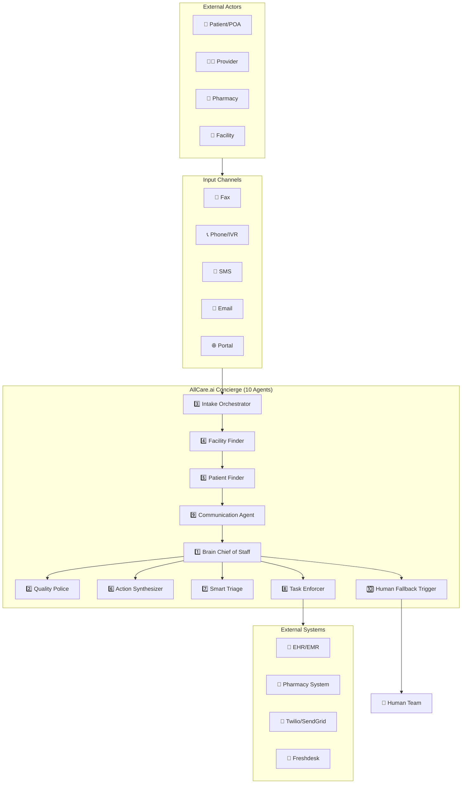
```mermaid
flowchart TB
    subgraph External["External Actors"]
        Patient["👤 Patient/POA"]
        Provider["👨‍⚕️ Provider"]
        Pharmacy["💊 Pharmacy"]
        Facility["🏥 Facility"]
    end
    
    subgraph Channels["Input Channels"]
        Fax["📠 Fax"]
        Phone["📞 Phone/IVR"]
        SMS["💬 SMS"]
        Email["📧 Email"]
        Portal["🌐 Portal"]
    end
    
    subgraph Concierge["AllCare.ai Concierge (10 Agents)"]
        Intake["3️⃣ Intake Orchestrator"]
        FacilityFinder["4️⃣ Facility Finder"]
        PatientFinder["5️⃣ Patient Finder"]
        CommAgent["9️⃣ Communication Agent"]
        Brain["1️⃣ Brain Chief of Staff"]
        QualityPolice["2️⃣ Quality Police"]
        ActionSynth["6️⃣ Action Synthesizer"]
        SmartTriage["7️⃣ Smart Triage"]
        TaskEnforcer["8️⃣ Task Enforcer"]
        HumanFallback["🔟 Human Fallback Trigger"]
    end
    
    subgraph Systems["External Systems"]
        EHR["🏥 EHR/EMR"]
        PharmSys["💊 Pharmacy System"]
        Messaging["📱 Twilio/SendGrid"]
        Ticketing["🎫 Freshdesk"]
    end
    
    External --> Channels
    Channels --> Intake
    Intake --> FacilityFinder
    FacilityFinder --> PatientFinder
    PatientFinder --> CommAgent
    CommAgent --> Brain
    Brain --> QualityPolice
    Brain --> ActionSynth
    Brain --> SmartTriage
    Brain --> TaskEnforcer
    Brain --> HumanFallback
    HumanFallback --> HumanTeam["👥 Human Team"]
    TaskEnforcer --> Systems
```

---

### Diagram B — Entry, Deduplication & Session Management (Facility-First, Identity-First)

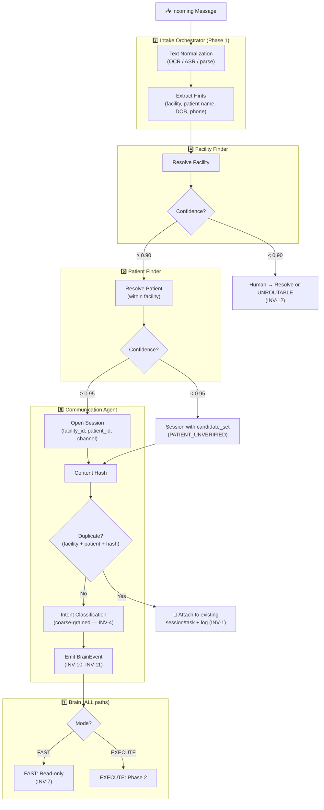
```mermaid
flowchart TB
    Input["📥 Incoming Message"]
    
    subgraph Intake["3️⃣ Intake Orchestrator (Phase 1)"]
        Normalize["Text Normalization<br/>(OCR / ASR / parse)"]
        Hints["Extract Hints<br/>(facility, patient name, DOB, phone)"]
        Normalize --> Hints
    end
    
    subgraph FF["4️⃣ Facility Finder"]
        ResolveFac["Resolve Facility"]
        FacConf{"Confidence?"}
        ResolveFac --> FacConf
    end
    
    subgraph PF["5️⃣ Patient Finder"]
        ResolvePat["Resolve Patient<br/>(within facility)"]
        PatConf{"Confidence?"}
        ResolvePat --> PatConf
    end
    
    subgraph Comm["9️⃣ Communication Agent"]
        Session["Open Session<br/>(facility_id, patient_id, channel)"]
        Hash["Content Hash"]
        Dedup{"Duplicate?<br/>(facility + patient + hash)"}
        Intent["Intent Classification<br/>(coarse-grained — INV-4)"]
        Emit["Emit BrainEvent<br/>(INV-10, INV-11)"]
        
        Session --> Hash --> Dedup
        Dedup -->|No| Intent
        Intent --> Emit
    end
    
    subgraph BrainBox["1️⃣ Brain (ALL paths)"]
        Route{"Mode?"}
        Fast["FAST: Read-only<br/>(INV-7)"]
        Exec["EXECUTE: Phase 2"]
        Route -->|FAST| Fast
        Route -->|EXECUTE| Exec
    end
    
    Input --> Normalize
    Hints --> ResolveFac
    
    FacConf -->|"≥ 0.90"| ResolvePat
    FacConf -->|"< 0.90"| FacAmbig["Human → Resolve or UNROUTABLE<br/>(INV-12)"]
    
    PatConf -->|"≥ 0.95"| Session
    PatConf -->|"< 0.95"| PatAmbig["Session with candidate_set<br/>(PATIENT_UNVERIFIED)"]
    PatAmbig --> Hash
    
    Dedup -->|Yes| Attach["📎 Attach to existing<br/>session/task + log (INV-1)"]
    
    Emit --> Route
```

---

### Diagram C — Two-Phase Intake (Facility-First)

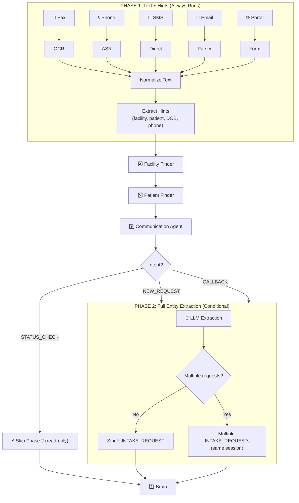
```mermaid
flowchart TB
    subgraph Phase1["PHASE 1: Text + Hints (Always Runs)"]
        Fax["📠 Fax"] --> OCR["OCR"]
        Phone["📞 Phone"] --> ASR["ASR"]
        SMS["💬 SMS"] --> Direct["Direct"]
        Email["📧 Email"] --> Parse["Parser"]
        Portal["🌐 Portal"] --> Form["Form"]
        
        OCR --> Norm["Normalize Text"]
        ASR --> Norm
        Direct --> Norm
        Parse --> Norm
        Form --> Norm
        
        Norm --> Extract["Extract Hints<br/>(facility, patient, DOB, phone)"]
    end
    
    Extract --> FF["4️⃣ Facility Finder"]
    FF --> PF["5️⃣ Patient Finder"]
    PF --> Comm["9️⃣ Communication Agent"]
    Comm --> Fork{"Intent?"}
    
    Fork -->|STATUS_CHECK| Skip["⚡ Skip Phase 2 (read-only)"]
    Fork -->|NEW_REQUEST| Phase2
    Fork -->|CALLBACK| Phase2
    
    subgraph Phase2["PHASE 2: Full Entity Extraction (Conditional)"]
        LLM["🤖 LLM Extraction"]
        Split{"Multiple requests?"}
        Single["Single INTAKE_REQUEST"]
        Multi["Multiple INTAKE_REQUESTs<br/>(same session)"]
        LLM --> Split
        Split -->|No| Single
        Split -->|Yes| Multi
    end
    
    Skip --> Brain["1️⃣ Brain"]
    Single --> Brain
    Multi --> Brain
```

---

### Diagram D — Intent-Based Routing (All Paths via Brain)

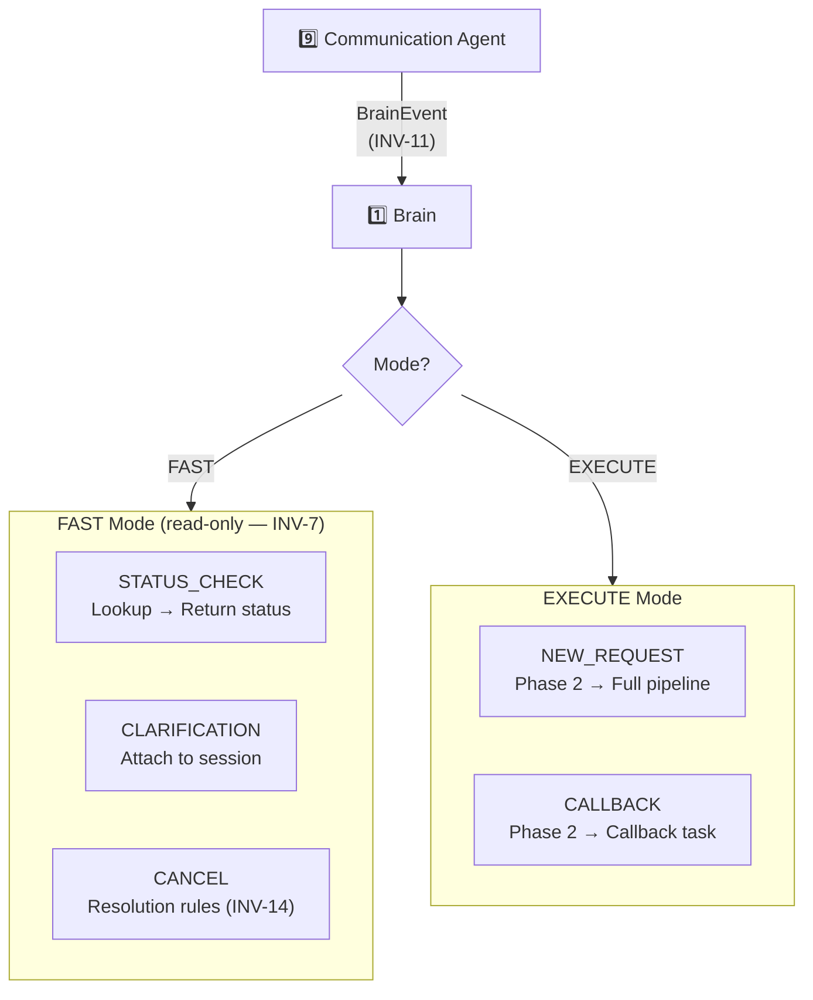
```mermaid
flowchart TB
    Comm["9️⃣ Communication Agent"] -->|"BrainEvent<br/>(INV-11)"| Brain["1️⃣ Brain"]
    
    Brain --> Mode{"Mode?"}
    
    Mode -->|"FAST"| FastPath
    Mode -->|"EXECUTE"| ExecPath
    
    subgraph FastPath["FAST Mode (read-only — INV-7)"]
        Status["STATUS_CHECK<br/>Lookup → Return status"]
        Clarify["CLARIFICATION<br/>Attach to session"]
        Cancel["CANCEL<br/>Resolution rules (INV-14)"]
    end
    
    subgraph ExecPath["EXECUTE Mode"]
        New["NEW_REQUEST<br/>Phase 2 → Full pipeline"]
        Callback["CALLBACK<br/>Phase 2 → Callback task"]
    end
```

---

### Diagram E — Validation & Judgment Flow

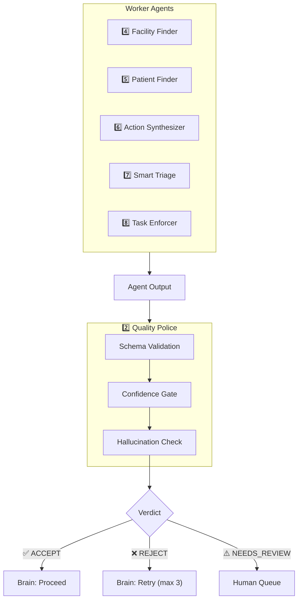
```mermaid
flowchart TB
    subgraph Workers["Worker Agents"]
        FacilityFinder["4️⃣ Facility Finder"]
        PatientFinder["5️⃣ Patient Finder"]
        ActionSynth["6️⃣ Action Synthesizer"]
        SmartTriage["7️⃣ Smart Triage"]
        TaskEnforcer["8️⃣ Task Enforcer"]
    end
    
    Workers --> Output["Agent Output"]
    Output --> QP
    
    subgraph QP["2️⃣ Quality Police"]
        Gate1["Schema Validation"]
        Gate2["Confidence Gate"]
        Gate3["Hallucination Check"]
        Gate1 --> Gate2 --> Gate3
    end
    
    Gate3 --> Verdict{"Verdict"}
    
    Verdict -->|"✅ ACCEPT"| Proceed["Brain: Proceed"]
    Verdict -->|"❌ REJECT"| Retry["Brain: Retry (max 3)"]
    Verdict -->|"⚠️ NEEDS_REVIEW"| Human["Human Queue"]
```

---

### Diagram F — Core Processing Pipeline

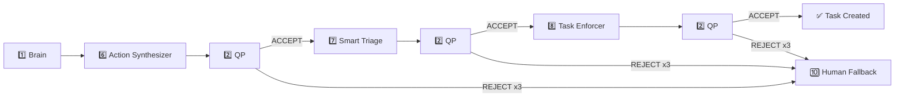
```mermaid
flowchart LR
    Brain["1️⃣ Brain"] --> AS["6️⃣ Action Synthesizer"]
    AS --> QP1["2️⃣ QP"]
    QP1 -->|ACCEPT| ST["7️⃣ Smart Triage"]
    ST --> QP2["2️⃣ QP"]
    QP2 -->|ACCEPT| TE["8️⃣ Task Enforcer"]
    TE --> QP3["2️⃣ QP"]
    QP3 -->|ACCEPT| Done["✅ Task Created"]
    
    QP1 -->|REJECT x3| Escalate["🔟 Human Fallback"]
    QP2 -->|REJECT x3| Escalate
    QP3 -->|REJECT x3| Escalate
```

---

### Diagram G — Escalation & Human-in-the-Loop

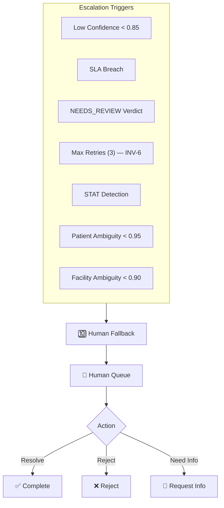
```mermaid
flowchart TB
    subgraph Triggers["Escalation Triggers"]
        T1["Low Confidence < 0.85"]
        T2["SLA Breach"]
        T3["NEEDS_REVIEW Verdict"]
        T4["Max Retries (3) — INV-6"]
        T5["STAT Detection"]
        T6["Patient Ambiguity < 0.95"]
        T7["Facility Ambiguity < 0.90"]
    end
    
    Triggers --> HF["🔟 Human Fallback"]
    HF --> Queue["👥 Human Queue"]
    
    Queue --> Action{"Action"}
    Action -->|"Resolve"| Complete["✅ Complete"]
    Action -->|"Reject"| Reject["❌ Reject"]
    Action -->|"Need Info"| Info["📝 Request Info"]
```

---

### Diagram H — End-to-End Happy Path (Facility-First, Identity-First)

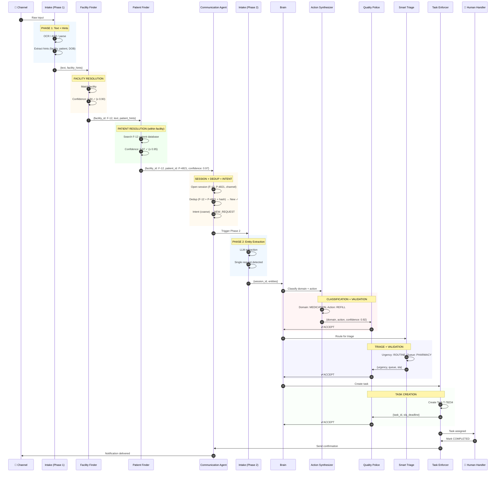
```mermaid
sequenceDiagram
    autonumber
    participant Ch as 📠 Channel
    participant IO1 as Intake (Phase 1)
    participant FF as Facility Finder
    participant PF as Patient Finder
    participant CA as Communication Agent
    participant IO2 as Intake (Phase 2)
    participant Brain as Brain
    participant AS as Action Synthesizer
    participant QP as Quality Police
    participant ST as Smart Triage
    participant TE as Task Enforcer
    participant H as 👤 Human Handler
    
    Ch->>IO1: Raw input
    
    rect rgb(240, 248, 255)
        Note over IO1: PHASE 1: Text + Hints
        IO1->>IO1: OCR / ASR / parse
        IO1->>IO1: Extract hints (facility, patient, DOB)
    end
    
    IO1->>FF: {text, facility_hints}
    
    rect rgb(255, 250, 240)
        Note over FF: FACILITY RESOLUTION
        FF->>FF: Match facility
        FF->>FF: Confidence: 0.94 ✓ (≥ 0.90)
    end
    
    FF->>PF: {facility_id: F-12, text, patient_hints}
    
    rect rgb(240, 255, 240)
        Note over PF: PATIENT RESOLUTION (within facility)
        PF->>PF: Search F-12 patient database
        PF->>PF: Confidence: 0.97 ✓ (≥ 0.95)
    end
    
    PF->>CA: {facility_id: F-12, patient_id: P-4821, confidence: 0.97}
    
    rect rgb(255, 250, 240)
        Note over CA: SESSION + DEDUP + INTENT
        CA->>CA: Open session (F-12, P-4821, channel)
        CA->>CA: Dedup (F-12 + P-4821 + hash) → New ✓
        CA->>CA: Intent (coarse) → NEW_REQUEST
    end
    
    CA->>IO2: Trigger Phase 2
    
    rect rgb(240, 248, 255)
        Note over IO2: PHASE 2: Entity Extraction
        IO2->>IO2: LLM extraction
        IO2->>IO2: Single request detected
    end
    
    IO2->>Brain: {session_id, entities}
    
    Brain->>AS: Classify domain + action
    
    rect rgb(255, 245, 245)
        Note over AS,QP: CLASSIFICATION + VALIDATION
        AS->>AS: Domain: MEDICATION, Action: REFILL
        AS->>QP: {domain, action, confidence: 0.92}
        QP->>Brain: ✅ ACCEPT
    end
    
    Brain->>ST: Route for triage
    
    rect rgb(245, 245, 255)
        Note over ST,QP: TRIAGE + VALIDATION
        ST->>ST: Urgency: ROUTINE, Queue: PHARMACY
        ST->>QP: {urgency, queue, sla}
        QP->>Brain: ✅ ACCEPT
    end
    
    Brain->>TE: Create task
    
    rect rgb(250, 255, 250)
        Note over TE,QP: TASK CREATION
        TE->>TE: Create Task T-78234
        TE->>QP: {task_id, sla_deadline}
        QP->>Brain: ✅ ACCEPT
    end
    
    TE->>H: Task assigned
    H->>TE: Mark COMPLETED
    TE->>CA: Send confirmation
    CA->>Ch: Notification delivered
```

---

### Diagram I — Agent Handshake Matrix

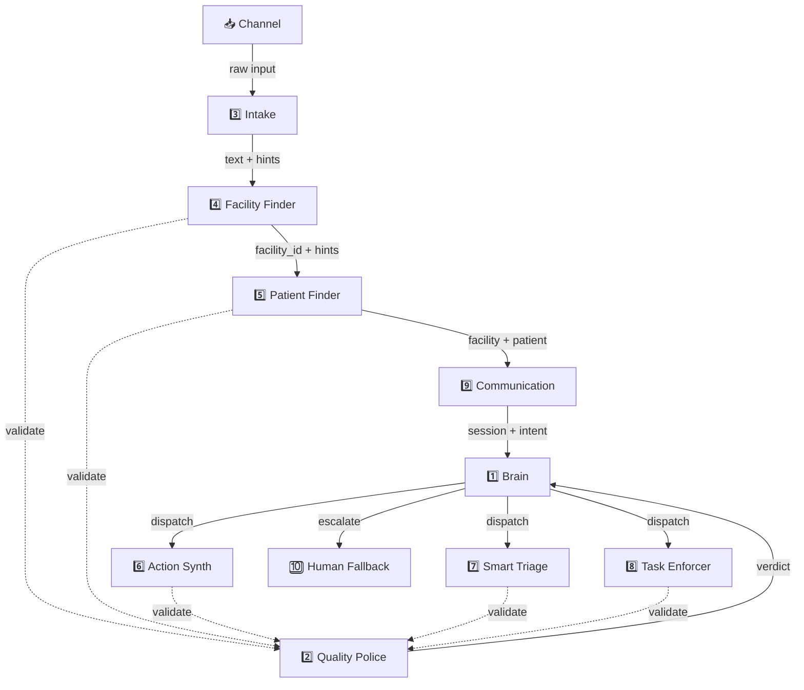
```mermaid
flowchart TB
    Channel["📥 Channel"] -->|raw input| Intake["3️⃣ Intake"]
    Intake -->|"text + hints"| FF["4️⃣ Facility Finder"]
    FF -->|"facility_id + hints"| PF["5️⃣ Patient Finder"]
    PF -->|"facility + patient"| Comm["9️⃣ Communication"]
    Comm -->|"session + intent"| Brain["1️⃣ Brain"]
    
    Brain -->|dispatch| AS["6️⃣ Action Synth"]
    Brain -->|dispatch| ST["7️⃣ Smart Triage"]
    Brain -->|dispatch| TE["8️⃣ Task Enforcer"]
    Brain -->|escalate| HF["🔟 Human Fallback"]
    
    FF -.->|validate| QP["2️⃣ Quality Police"]
    PF -.->|validate| QP
    AS -.->|validate| QP
    ST -.->|validate| QP
    TE -.->|validate| QP
    
    QP -->|verdict| Brain
```

---

### Diagram J — Build Order

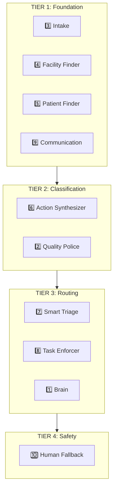
```mermaid
flowchart TB
    subgraph Tier1["TIER 1: Foundation"]
        T1A["3️⃣ Intake"]
        T1B["4️⃣ Facility Finder"]
        T1C["5️⃣ Patient Finder"]
        T1D["9️⃣ Communication"]
    end
    
    subgraph Tier2["TIER 2: Classification"]
        T2A["6️⃣ Action Synthesizer"]
        T2B["2️⃣ Quality Police"]
    end
    
    subgraph Tier3["TIER 3: Routing"]
        T3A["7️⃣ Smart Triage"]
        T3B["8️⃣ Task Enforcer"]
        T3C["1️⃣ Brain"]
    end
    
    subgraph Tier4["TIER 4: Safety"]
        T4A["🔟 Human Fallback"]
    end
    
    Tier1 --> Tier2 --> Tier3 --> Tier4
```

---

## 6. Naming & Translation Table

| Product Term | Internal Agent |
|--------------|----------------|
| Message Router | **Communication Agent** |
| Decision Engine | **Brain Chief of Staff** |
| Safety Gate | **Quality Police** |
| Intake Gateway | **Intake Orchestrator** |
| Facility Matcher | **Facility Finder** |
| Patient Matcher | **Patient Finder** |
| Request Classifier | **Action Synthesizer** |
| Priority Engine | **Smart Triage** |
| Task Manager | **Task Enforcer** |
| Escalation Handler | **Human Fallback Trigger** |

---

## 7. Architectural Principles

### 1. Facility-First, Then Identity-First
Facility is resolved before patient. Patient is resolved before session. Sessions are keyed by `(facility_id, patient_id, channel)`.

### 2. Event-Driven, Not Linear Pipeline
Agents communicate via events. Brain reacts to outcomes. Enables retries and branching.

### 3. Facility+Patient-Scoped Deduplication
Dedup key = `(facility_id, patient_id, content_hash)`. Same content for different patients or facilities creates separate tasks.

### 4. Quality Police is Judge, Not Advisor
Has veto power. REJECT cannot be overridden. Prevents unsafe outputs.

### 5. Brain Never Validates, Only Orchestrates
Brain decides "what next." Quality Police decides "is it safe." Brain enforces retry limits (INV-6).

### 6. Agents Never Share Databases
Each agent has its own data view. Communication via contracts.

### 7. Humans Permanently Take Over Once Escalated
No ping-pong. Human completes task to end.

### 8. Concierge is Not a Clinical System of Record
Concierge owns orchestration and communication records. Patient/task execution data remains in existing systems.

---

## 8. Architecture Clarifications

### A. Intent Classification Scope

**Location:** Inside Communication Agent  
**Type:** Coarse-grained routing only

Communication Agent answers: "What type of response is needed?"
- NEW_REQUEST → Full pipeline
- CALLBACK → Full pipeline
- STATUS_CHECK → Fast path (read-only)
- CLARIFICATION → Attach to session (read-only)
- CANCEL → Attach to task

Communication Agent does **NOT** answer: "What clinical domain? What specific action?"
That is Action Synthesizer's responsibility.

---

### B. Task Creation Rules

| Intent | Creates Task? | Behavior |
|--------|---------------|----------|
| **NEW_REQUEST** | ✅ Yes | Full pipeline → new task |
| **CALLBACK** | ✅ Yes | Full pipeline → callback task |
| **STATUS_CHECK** | ❌ No | Read-only lookup |
| **CLARIFICATION** | ❌ No | Attach to existing session |
| **CANCEL** | ❌ No | Attach to existing task, mark cancelled |

**Rule (INV-3):** Only execution-required intents (NEW_REQUEST, CALLBACK) create tasks.

---

### C. Quality Police — When It Runs

| Agent | QP Validates? | Why |
|-------|---------------|-----|
| Facility Finder | ✅ Yes | Facility affects all downstream routing |
| Patient Finder | ✅ Yes | Identity accuracy is safety-critical |
| Action Synthesizer | ✅ Yes | Classification drives routing |
| Smart Triage | ✅ Yes | Urgency affects SLA |
| Task Enforcer | ✅ Yes | Task creation is auditable |
| Communication Agent | ❌ No | Coarse routing, not inference |
| Intake Orchestrator | ❌ No | Text extraction, not classification |

**Execution:** QP runs per agent output. Max 3 retries per agent (INV-6).

---

### D. Smart Triage Responsibility

**Does:**
- Classify urgency (STAT / URGENT / ROUTINE)
- Determine queue assignment
- Apply rule-based overrides

**Does NOT:**
- Create tasks (Task Enforcer does)
- Deduplicate (Communication Agent does)
- Validate its own output (Quality Police does)

---

### E. Ambiguous Identity Handling

**Facility Ambiguous (< 0.90):**
1. Escalate to Human Fallback immediately
2. Human selects facility
3. Flow continues to Patient Finder

**Patient Ambiguous (< 0.95):**
1. Communication Agent opens session with `candidate_set`
2. Session marked `PATIENT_UNVERIFIED`
3. Provisional dedup key: `(candidate_set_hash, content_hash)`
4. Human resolves via Human Fallback
5. Session re-keyed to `(facility_id, patient_id, content_hash)` — INV-2

---

### F. Multi-Request Handling

When a single inbound message contains multiple distinct requests:
1. Intake Phase 2 detects multiple requests
2. Phase 2 emits multiple `INTAKE_REQUEST` records under the same `INTAKE_SESSION`
3. Each request proceeds through classification/triage/task independently
4. All requests share the same session context (INV-9)

---

## 9. Operational Sequence Diagrams

### Sequence 1 — Duplicate Message (Attach, Not Discard)

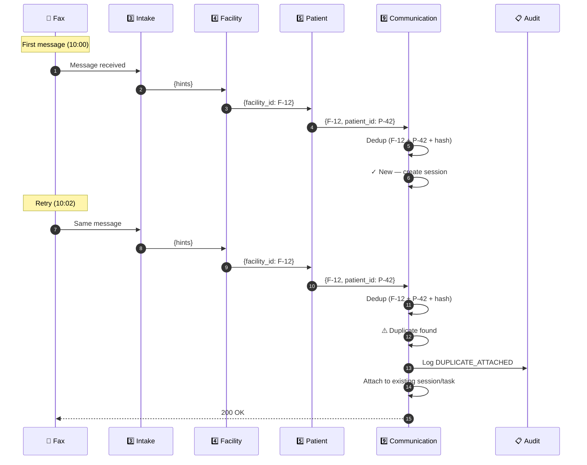
```mermaid
sequenceDiagram
    autonumber
    participant Fax as 📠 Fax
    participant I as 3️⃣ Intake
    participant FF as 4️⃣ Facility
    participant PF as 5️⃣ Patient
    participant C as 9️⃣ Communication
    participant Audit as 📋 Audit
    
    Note over Fax: First message (10:00)
    Fax->>I: Message received
    I->>FF: {hints}
    FF->>PF: {facility_id: F-12}
    PF->>C: {F-12, patient_id: P-42}
    C->>C: Dedup (F-12 + P-42 + hash)
    C->>C: ✓ New — create session
    
    Note over Fax: Retry (10:02)
    Fax->>I: Same message
    I->>FF: {hints}
    FF->>PF: {facility_id: F-12}
    PF->>C: {F-12, patient_id: P-42}
    C->>C: Dedup (F-12 + P-42 + hash)
    C->>C: ⚠️ Duplicate found
    C->>Audit: Log DUPLICATE_ATTACHED
    C->>C: Attach to existing session/task
    C-->>Fax: 200 OK
```

| Behavior | Attach to existing session/task + log (INV-1) |
| Data Loss | None — original preserved |

---

### Sequence 2 — STATUS_CHECK Fast Path (Read-Only)

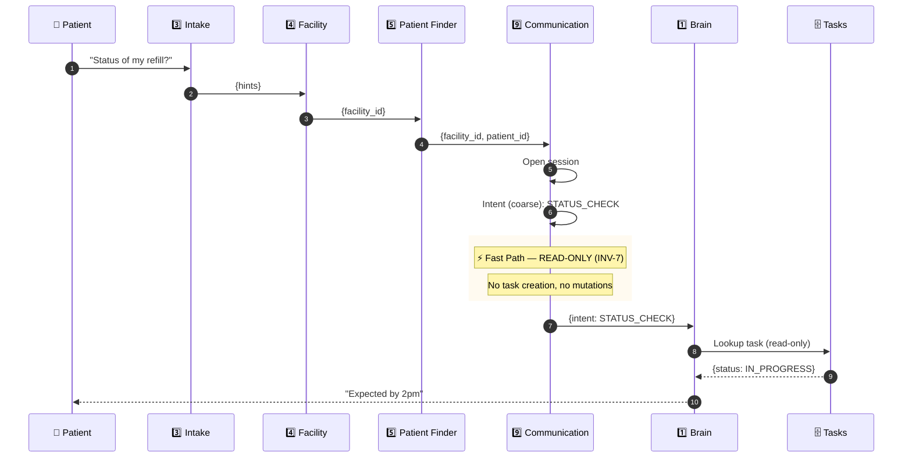
```mermaid
sequenceDiagram
    autonumber
    participant P as 👤 Patient
    participant I as 3️⃣ Intake
    participant FF as 4️⃣ Facility
    participant PF as 5️⃣ Patient Finder
    participant C as 9️⃣ Communication
    participant B as 1️⃣ Brain
    participant DB as 🗄️ Tasks
    
    P->>I: "Status of my refill?"
    I->>FF: {hints}
    FF->>PF: {facility_id}
    PF->>C: {facility_id, patient_id}
    
    C->>C: Open session
    C->>C: Intent (coarse): STATUS_CHECK
    
    rect rgb(255, 250, 240)
        Note over C: ⚡ Fast Path — READ-ONLY (INV-7)
        Note over C: No task creation, no mutations
    end
    
    C->>B: {intent: STATUS_CHECK}
    B->>DB: Lookup task (read-only)
    DB-->>B: {status: IN_PROGRESS}
    B-->>P: "Expected by 2pm"
```

---

### Sequence 3 — Max Retries → Escalation (INV-6)

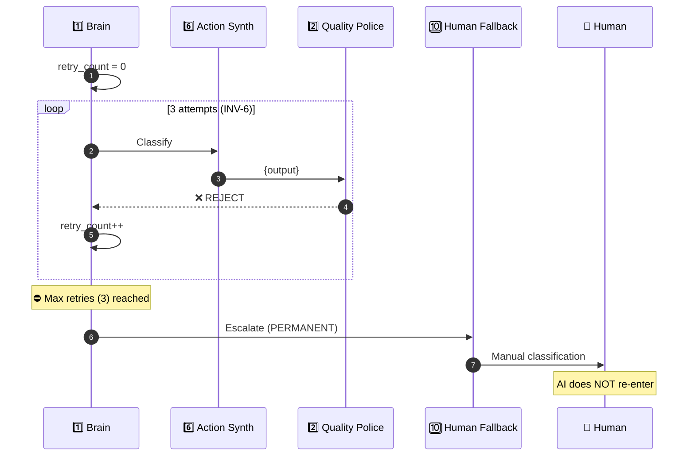
```mermaid
sequenceDiagram
    autonumber
    participant B as 1️⃣ Brain
    participant AS as 6️⃣ Action Synth
    participant QP as 2️⃣ Quality Police
    participant HF as 🔟 Human Fallback
    participant H as 👤 Human
    
    B->>B: retry_count = 0
    
    loop 3 attempts (INV-6)
        B->>AS: Classify
        AS->>QP: {output}
        QP-->>B: ❌ REJECT
        B->>B: retry_count++
    end
    
    Note over B: ⛔ Max retries (3) reached
    B->>HF: Escalate (PERMANENT)
    HF->>H: Manual classification
    
    Note over H: AI does NOT re-enter
```

---

### Sequence 4 — Patient Ambiguous → Re-key (INV-2)

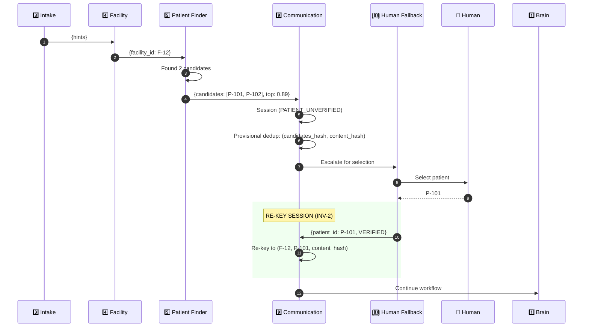
```mermaid
sequenceDiagram
    autonumber
    participant I as 3️⃣ Intake
    participant FF as 4️⃣ Facility
    participant PF as 5️⃣ Patient Finder
    participant C as 9️⃣ Communication
    participant HF as 🔟 Human Fallback
    participant H as 👤 Human
    participant B as 1️⃣ Brain
    
    I->>FF: {hints}
    FF->>PF: {facility_id: F-12}
    PF->>PF: Found 2 candidates
    PF->>C: {candidates: [P-101, P-102], top: 0.89}
    
    C->>C: Session (PATIENT_UNVERIFIED)
    C->>C: Provisional dedup: (candidates_hash, content_hash)
    C->>HF: Escalate for selection
    
    HF->>H: Select patient
    H-->>HF: P-101
    
    rect rgb(240, 255, 240)
        Note over C: RE-KEY SESSION (INV-2)
        HF->>C: {patient_id: P-101, VERIFIED}
        C->>C: Re-key to (F-12, P-101, content_hash)
    end
    
    C->>B: Continue workflow
```

---

### Sequence 5 — Multi-Request Split (INV-9)

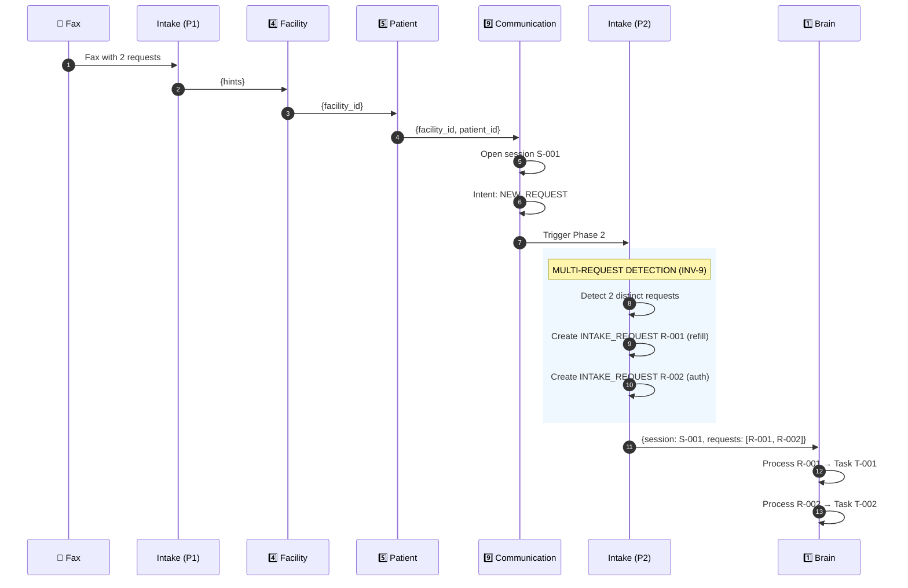
```mermaid
sequenceDiagram
    autonumber
    participant Ch as 📠 Fax
    participant IO1 as Intake (P1)
    participant FF as 4️⃣ Facility
    participant PF as 5️⃣ Patient
    participant CA as 9️⃣ Communication
    participant IO2 as Intake (P2)
    participant B as 1️⃣ Brain
    
    Ch->>IO1: Fax with 2 requests
    IO1->>FF: {hints}
    FF->>PF: {facility_id}
    PF->>CA: {facility_id, patient_id}
    
    CA->>CA: Open session S-001
    CA->>CA: Intent: NEW_REQUEST
    CA->>IO2: Trigger Phase 2
    
    rect rgb(240, 248, 255)
        Note over IO2: MULTI-REQUEST DETECTION (INV-9)
        IO2->>IO2: Detect 2 distinct requests
        IO2->>IO2: Create INTAKE_REQUEST R-001 (refill)
        IO2->>IO2: Create INTAKE_REQUEST R-002 (auth)
    end
    
    IO2->>B: {session: S-001, requests: [R-001, R-002]}
    
    B->>B: Process R-001 → Task T-001
    B->>B: Process R-002 → Task T-002
```

---

## 10. Agent Handshake Table

| From | To | Data |
|------|----|------|
| Channel | Intake (Phase 1) | raw input |
| Intake (Phase 1) | Facility Finder | `{text, facility_hints}` |
| Facility Finder | Patient Finder | `{facility_id, text, patient_hints}` |
| Patient Finder | Communication Agent | `{facility_id, patient_id, confidence}` or `{facility_id, candidates}` |
| Communication Agent | **Brain** | `BrainEvent {session_id, request_id?, intent, source_agent, mode, payload}` (INV-11) |
| Brain | Intake (Phase 2) | `{session_id}` (if EXECUTE mode) |
| Intake (Phase 2) | Brain | `BrainEvent {mode: RESUME, request_ids[], entities[]}` |
| Brain | Action Synthesizer | `{text, session_id, request_id}` |
| Action Synthesizer | Quality Police | `{domain, action, confidence}` |
| Brain | Smart Triage | `{classification}` |
| Smart Triage | Quality Police | `{urgency, queue}` |
| Brain | Task Enforcer | `{routed_task}` |
| Task Enforcer | Quality Police | `{task_id, sla}` |
| Quality Police | Brain | `{verdict}` |
| Brain | Human Fallback | `{escalation_context, retry_count}` |
| Human Fallback | Brain | `BrainEvent {mode: RESUME, resolution}` |

---

## 11. Database Design

### Design Principle

Concierge is an **orchestration and communication layer**, not a clinical or execution system of record. It references the existing Tasks platform for execution and patient data.

---

### Entity Relationship Diagram

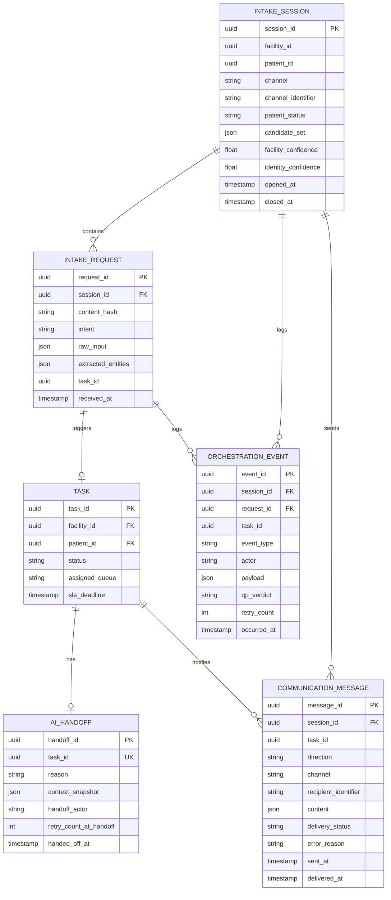
```mermaid
erDiagram
    INTAKE_SESSION ||--o{ INTAKE_REQUEST : contains
    INTAKE_SESSION ||--o{ ORCHESTRATION_EVENT : logs
    INTAKE_SESSION ||--o{ COMMUNICATION_MESSAGE : sends
    INTAKE_REQUEST ||--o| TASK : triggers
    INTAKE_REQUEST ||--o{ ORCHESTRATION_EVENT : logs
    TASK ||--o| AI_HANDOFF : has
    TASK ||--o{ COMMUNICATION_MESSAGE : notifies
    
    INTAKE_SESSION {
        uuid session_id PK
        uuid facility_id
        uuid patient_id
        string channel
        string channel_identifier
        string patient_status
        json candidate_set
        float facility_confidence
        float identity_confidence
        timestamp opened_at
        timestamp closed_at
    }
    
    INTAKE_REQUEST {
        uuid request_id PK
        uuid session_id FK
        string content_hash
        string intent
        json raw_input
        json extracted_entities
        uuid task_id
        timestamp received_at
    }
    
    COMMUNICATION_MESSAGE {
        uuid message_id PK
        uuid session_id FK
        uuid task_id
        string direction
        string channel
        string recipient_identifier
        json content
        string delivery_status
        string error_reason
        timestamp sent_at
        timestamp delivered_at
    }
    
    ORCHESTRATION_EVENT {
        uuid event_id PK
        uuid session_id FK
        uuid request_id FK
        uuid task_id
        string event_type
        string actor
        json payload
        string qp_verdict
        int retry_count
        timestamp occurred_at
    }
    
    AI_HANDOFF {
        uuid handoff_id PK
        uuid task_id UK
        string reason
        json context_snapshot
        string handoff_actor
        int retry_count_at_handoff
        timestamp handed_off_at
    }
    
    TASK {
        uuid task_id PK
        uuid facility_id FK
        uuid patient_id FK
        string status
        string assigned_queue
        timestamp sla_deadline
    }
```

---

### Table Definitions

#### INTAKE_SESSION

| Field | Type | Description |
|-------|------|-------------|
| `session_id` | uuid | Primary key |
| `facility_id` | uuid | Resolved facility (INV-5) |
| `patient_id` | uuid | Resolved patient (nullable if UNVERIFIED) |
| `channel` | enum | SMS, EMAIL, FAX, PHONE, PORTAL |
| `channel_identifier` | string | Reply address |
| `patient_status` | enum | VERIFIED, UNVERIFIED |
| `candidate_set` | json | Ambiguous patient matches |
| `facility_confidence` | float | Facility Finder score |
| `identity_confidence` | float | Patient Finder score |
| `opened_at` | timestamp | Session start |
| `closed_at` | timestamp | Session end |

---

#### INTAKE_REQUEST

| Field | Type | Description |
|-------|------|-------------|
| `request_id` | uuid | Primary key |
| `session_id` | uuid | FK — multiple requests per session allowed (INV-9) |
| `content_hash` | string | Dedup key component |
| `intent` | enum | NEW_REQUEST, STATUS_CHECK, CLARIFICATION, CANCEL, CALLBACK |
| `raw_input` | json | Original message (immutable) |
| `extracted_entities` | json | Phase 2 output |
| `task_id` | uuid | FK to TASK if execution-required intent |
| `received_at` | timestamp | When received |

---

#### COMMUNICATION_MESSAGE

| Field | Type | Description |
|-------|------|-------------|
| `message_id` | uuid | Primary key |
| `session_id` | uuid | FK |
| `task_id` | uuid | FK (nullable) |
| `direction` | enum | INBOUND, OUTBOUND |
| `channel` | enum | SMS, EMAIL, FAX, PORTAL, PHONE |
| `recipient_identifier` | string | Delivery address |
| `content` | json | Message body |
| `delivery_status` | enum | QUEUED, SENT, DELIVERED, FAILED |
| `error_reason` | string | Nullable |
| `sent_at` | timestamp | Dispatch time |
| `delivered_at` | timestamp | Confirmation time |

---

#### ORCHESTRATION_EVENT

| Field | Type | Description |
|-------|------|-------------|
| `event_id` | uuid | Primary key |
| `session_id` | uuid | FK |
| `request_id` | uuid | FK |
| `task_id` | uuid | FK (nullable) |
| `event_type` | string | See event types |
| `actor` | string | Agent identifier |
| `payload` | json | Event data |
| `qp_verdict` | enum | ACCEPT, REJECT, NEEDS_REVIEW |
| `retry_count` | int | Current retry count (INV-6) |
| `occurred_at` | timestamp | Event time |

**Event Types:**

| event_type | Description |
|------------|-------------|
| `FACILITY_RESOLVED` | Facility Finder matched |
| `FACILITY_AMBIGUOUS` | Facility Finder returned candidates |
| `FACILITY_UNROUTABLE` | Facility unresolvable after human review (INV-12) |
| `IDENTITY_RESOLVED` | Patient Finder matched |
| `IDENTITY_AMBIGUOUS` | Patient Finder returned candidates |
| `SESSION_OPENED` | Session created |
| `SESSION_REKEYED` | Session re-keyed after human resolution (INV-2) |
| `SESSION_CLOSED_UNROUTABLE` | Session closed, facility unresolvable (INV-12) |
| `DUPLICATE_ATTACHED` | Dedup attached to existing (INV-1) |
| `INTENT_CLASSIFIED` | Coarse intent determined |
| `BRAIN_EVENT_RECEIVED` | Brain received BrainEvent (INV-11) |
| `PHASE2_COMPLETED` | Entity extraction done |
| `MULTI_REQUEST_SPLIT` | Multiple requests detected (INV-9) |
| `MULTI_REQUEST_LIMIT_EXCEEDED` | > 5 requests, human review (INV-9) |
| `DOMAIN_CLASSIFIED` | Action Synthesizer output |
| `QP_VALIDATION` | Quality Police verdict |
| `TRIAGE_COMPLETED` | Smart Triage output |
| `TASK_CREATED` | Task created by Task Enforcer |
| `RETRY_ATTEMPTED` | Retry occurred (INV-6) |
| `HANDOFF_INITIATED` | AI exited |
| `CANCEL_RESOLVED` | CANCEL intent processed (INV-14) |
| `CANCEL_NOOP` | CANCEL no-op (task completed/not found) |

---

#### AI_HANDOFF

| Field | Type | Description |
|-------|------|-------------|
| `handoff_id` | uuid | Primary key |
| `task_id` | uuid | Unique FK |
| `reason` | enum | LOW_CONFIDENCE, MAX_RETRIES, SLA_BREACH, PATIENT_AMBIGUOUS, FACILITY_AMBIGUOUS, VALIDATION_REJECT |
| `context_snapshot` | json | AI state |
| `handoff_actor` | string | Agent that triggered |
| `retry_count_at_handoff` | int | Retries before handoff |
| `handed_off_at` | timestamp | Handoff time |

---

### Relationship to Existing Systems

| Concern | Owner | Concierge Role |
|---------|-------|----------------|
| Patient master data | Existing system | References only |
| Facility master data | Existing system | References only |
| Task creation | Tasks platform | Triggers via API |
| Task lifecycle | Tasks platform | Read-only reference |
| Facility resolution | **Concierge** | INTAKE_SESSION.facility_id |
| Identity verification | **Concierge** | INTAKE_SESSION.patient_status |
| Deduplication | **Concierge** | (facility_id, patient_id, content_hash) |
| Intent classification | **Concierge** | INTAKE_REQUEST.intent |
| AI orchestration audit | **Concierge** | ORCHESTRATION_EVENT |
| AI safety handoff | **Concierge** | AI_HANDOFF |
| Patient notifications | **Concierge** | COMMUNICATION_MESSAGE |

---

## 12. Auditability & Compliance

### Regulatory Reconstruction Path

```
INTAKE_SESSION
  (facility_id, patient_id, channel_identifier, patient_status)
  │
  └─► INTAKE_REQUEST (original message, intent, content_hash)
        │
        ├─► ORCHESTRATION_EVENT (all AI decisions, QP verdicts, retry counts)
        │
        ├─► TASK (execution outcome via Tasks platform)
        │     │
        │     └─► AI_HANDOFF (if escalated, with retry_count_at_handoff)
        │
        └─► COMMUNICATION_MESSAGE (patient notifications, delivery status)
```

### Key Audit Questions Answered

| Question | Data Source |
|----------|-------------|
| Which facility? | INTAKE_SESSION.facility_id |
| Which patient? How confident? | INTAKE_SESSION.patient_id, identity_confidence |
| Was patient verified? | INTAKE_SESSION.patient_status |
| Was this a duplicate? | ORCHESTRATION_EVENT.event_type = DUPLICATE_ATTACHED |
| What intent was classified? | INTAKE_REQUEST.intent |
| How many retries before escalation? | AI_HANDOFF.retry_count_at_handoff |
| Did we notify the patient? | COMMUNICATION_MESSAGE.delivery_status |
| When did AI hand off? | AI_HANDOFF.handed_off_at |

---

## 13. Stop Conditions & Ownership Transfer

| Scenario | Stop Condition | Transfer | AI Re-entry |
|----------|----------------|----------|-------------|
| Duplicate | `(facility, patient, hash)` exists | Attach to existing (INV-1) | N/A |
| STATUS_CHECK | Intent match | Read-only fast path (INV-7) | N/A |
| CLARIFICATION | Intent match | Read-only attach (INV-7) | N/A |
| CANCEL (single task) | Intent match + 1 active task | Cancel task (INV-14) | N/A |
| CANCEL (multiple tasks) | Intent match + >1 active task | Human clarification (INV-14) | N/A |
| CANCEL (completed/none) | Intent match + no active task | No-op + notify (INV-14) | N/A |
| NEEDS_REVIEW | Confidence 0.70–0.85 | AI → Human | No |
| REJECT × 3 | Max retries (INV-6) | AI → Human | ❌ Never |
| Patient Ambiguous | Top < 0.95 | AI → Human → AI | ✅ (re-key INV-2) |
| Facility Ambiguous | Top < 0.90 | AI → Human | ✅ (then patient) |
| Facility Unresolvable | Human cannot resolve | UNROUTABLE + notify (INV-12) | ❌ Closed |
| Multi-Request Limit | > 5 requests (INV-9) | Human review before split | ✅ After review |
| SLA Breach | Deadline passed | Escalation chain | N/A |

---

## 14. Agent Responsibility Summary

| Agent | Responsibility | Validated by QP? |
|-------|----------------|------------------|
| **Intake Orchestrator** | Text extraction, hints, entity extraction, multi-request split (max 5 — INV-9) | No |
| **Facility Finder** | Facility resolution; UNROUTABLE if unresolvable (INV-12) | Yes |
| **Patient Finder** | Patient resolution (within facility) | Yes |
| **Communication Agent** | Session, dedup, coarse intent (INV-4), emit BrainEvent (INV-10), outbound messaging | No |
| **Brain** | Orchestration, dispatch, retry enforcement (INV-6), mode routing (INV-11), CANCEL resolution (INV-14) | No |
| **Action Synthesizer** | Domain + action classification (semantic) | Yes |
| **Smart Triage** | Urgency + queue assignment; SLA rule resolution (INV-13) | Yes |
| **Task Enforcer** | Task lifecycle, SLA enforcement (INV-13) | Yes |
| **Quality Police** | Validation, veto power | — |
| **Human Fallback** | Escalation packaging | No |

---

*AllCare.ai Concierge — Product ↔ Technology Architecture v1.5*
