# AllCare.ai Concierge — Product ↔ Technology Architecture

**Version:** 1.3  
**Status:** Engineering Ready  
**Date:** February 2026

---

## Table of Contents

1. [Executive Summary](#1-executive-summary)
2. [Canonical Entry Flow](#2-canonical-entry-flow)
3. [Product ↔ Tech Responsibility Mapping](#3-product--tech-responsibility-mapping)
4. [Architecture Diagrams](#4-architecture-diagrams)
5. [Naming & Translation Table](#5-naming--translation-table)
6. [Architectural Principles](#6-architectural-principles)
7. [Architecture Clarifications](#7-architecture-clarifications)
8. [Operational Sequence Diagrams](#8-operational-sequence-diagrams)
9. [Agent Handshake Table](#9-agent-handshake-table)
10. [Database Design](#10-database-design)
11. [Auditability & Compliance](#11-auditability--compliance)

---

## 1. Executive Summary

AllCare.ai Concierge is a **9-agent AI workforce** that handles care coordination requests from intake to completion.

### The 9 Agents

| # | Agent | Role |
|---|-------|------|
| 1 | **Brain Chief of Staff** | Orchestrator |
| 2 | **Quality Police** | Validator / Judge |
| 3 | **Intake Orchestrator** | Text + Entity Extraction |
| 4 | **Patient Finder** | Identity Resolution |
| 5 | **Action Synthesizer** | Domain Classification |
| 6 | **Smart Triage** | Urgency + Routing |
| 7 | **Task Enforcer** | Lifecycle + SLA |
| 8 | **Communication Agent** | Session + Dedup + Intent + Messaging |
| 9 | **Human Fallback Trigger** | HITL Escalation |

---

## 2. Canonical Entry Flow

```
Channel (Fax / Phone / SMS / Email / Portal)
  │
  ▼
Intake Orchestrator — Phase 1
  • Text normalization (OCR / ASR / parse)
  • Lightweight patient hints (name, DOB, phone)
  │
  ▼
Patient Finder
  • Resolve patient_id (≥ 0.95 confidence)
  • OR return candidate_set (< 0.95)
  │
  ▼
Communication Agent
  • Open patient-scoped session
  • Deduplicate by (patient_id, content_hash)
  • Classify intent
  │
  ├─► STATUS_CHECK ──► Fast path (skip Phase 2) ──► Brain
  ├─► CLARIFICATION ─► Link to existing session ──► Brain
  ├─► CANCEL ────────► Cancel existing task ──────► Brain
  │
  └─► NEW_REQUEST
        │
        ▼
      Intake Orchestrator — Phase 2
        • Full entity extraction (LLM)
        │
        ▼
      Brain ──► Action Synthesizer ──► Smart Triage ──► Task Enforcer
```

### Why Identity Precedes Session (Identity-First Model)

In healthcare, session and deduplication must be **patient-scoped** because:

1. **HIPAA compliance** — Channel-scoped dedup could merge requests from different patients
2. **Clinical safety** — Two patients sending identical faxes must create two tasks
3. **Session continuity** — A caregiver calling for multiple patients needs isolated sessions

---

## 3. Product ↔ Tech Responsibility Mapping

| Product Concept | Owning Agent | MUST Do | MUST NOT Do |
|-----------------|--------------|---------|-------------|
| Handle fax + voice intake | **Intake Orchestrator** | OCR, ASR, normalize to text, extract patient hints (Phase 1), full entity extraction (Phase 2) | Classify intent, resolve patient identity, hold session state |
| Identify which patient | **Patient Finder** | Resolve patient_id from hints EARLY in flow; return verified ID or candidate set | Hold session state, deduplicate, classify intent |
| Prevent duplicate requests | **Communication Agent** | Open patient-scoped session; deduplicate by `(patient_id, content_hash)`; classify intent | Resolve patient identity; create tasks |
| Classify what's needed | **Action Synthesizer** | Extract domain + action + details | Route, triage, or execute |
| Prioritize urgency | **Smart Triage** | Apply STAT/URGENT/ROUTINE rules; determine queue assignment | Execute tasks, create tasks, deduplicate |
| Track task SLA | **Task Enforcer** | Create task, set SLA, monitor, alert on breach | Classify urgency, deduplicate |
| Validate AI output safety | **Quality Police** | Schema check, confidence gate, hallucination check, reject unsafe | Produce content, override verdicts |
| Ensure human intervention | **Human Fallback Trigger** | Package context, route to human queue | Return to AI after human takeover |
| Coordinate everything | **Brain Chief of Staff** | Dispatch, sequence, react to verdicts | Validate, execute, or judge quality |

---

## 4. Architecture Diagrams

### Diagram A — System Context

```mermaid
flowchart TB
    subgraph External["External Actors"]
        Patient["👤 Patient/POA"]
        Provider["👨‍⚕️ Provider"]
        Pharmacy["💊 Pharmacy"]
        Facility["🏥 Facility"]
    end
    
    subgraph Channels["Input Channels"]
        Fax["📠 Fax"]
        Phone["📞 Phone/IVR"]
        SMS["💬 SMS"]
        Email["📧 Email"]
        Portal["🌐 Portal"]
    end
    
    subgraph Concierge["AllCare.ai Concierge (9 Agents)"]
        Intake["3️⃣ Intake Orchestrator"]
        PatientFinder["4️⃣ Patient Finder"]
        CommAgent["8️⃣ Communication Agent"]
        Brain["1️⃣ Brain Chief of Staff"]
        QualityPolice["2️⃣ Quality Police"]
        ActionSynth["5️⃣ Action Synthesizer"]
        SmartTriage["6️⃣ Smart Triage"]
        TaskEnforcer["7️⃣ Task Enforcer"]
        HumanFallback["9️⃣ Human Fallback Trigger"]
    end
    
    subgraph Systems["External Systems"]
        EHR["🏥 EHR/EMR"]
        PharmSys["💊 Pharmacy System"]
        Messaging["📱 Twilio/SendGrid"]
        Ticketing["🎫 Freshdesk"]
    end
    
    External --> Channels
    Channels --> Intake
    Intake --> PatientFinder
    PatientFinder --> CommAgent
    CommAgent --> Brain
    Brain --> QualityPolice
    Brain --> ActionSynth
    Brain --> SmartTriage
    Brain --> TaskEnforcer
    Brain --> HumanFallback
    HumanFallback --> HumanTeam["👥 Human Team"]
    TaskEnforcer --> Systems
```

---

### Diagram B — Entry, Deduplication & Session Management (Identity-First)

```mermaid
flowchart TB
    Input["📥 Incoming Message"]
    
    subgraph Intake["3️⃣ Intake Orchestrator (Phase 1)"]
        Normalize["Text Normalization<br/>(OCR / ASR / parse)"]
        Hints["Patient Hints Extraction<br/>(name, DOB, phone)"]
        Normalize --> Hints
    end
    
    subgraph PF["4️⃣ Patient Finder"]
        Resolve["Resolve Identity"]
        Conf{"Confidence?"}
        Resolve --> Conf
    end
    
    subgraph Comm["8️⃣ Communication Agent"]
        Session["Open Session<br/>(patient_id, channel)"]
        Hash["Content Hash"]
        Dedup{"Duplicate?<br/>(patient_id + hash)"}
        Intent["Intent Classification"]
        
        Session --> Hash --> Dedup
        Dedup -->|No| Intent
    end
    
    Input --> Normalize
    Hints --> Resolve
    
    Conf -->|"≥ 0.95"| Session
    Conf -->|"< 0.95"| Ambiguous["Session with candidate_set<br/>(PATIENT_UNVERIFIED)"]
    Ambiguous --> Hash
    
    Dedup -->|Yes| Discard["🗑️ Discard"]
    
    Intent --> Route{"Intent"}
    Route -->|NEW_REQUEST| Phase2["➡️ Intake Phase 2"]
    Route -->|STATUS_CHECK| Fast["⚡ Fast Path"]
    Route -->|CLARIFICATION| Link["🔗 Link Session"]
    Route -->|CANCEL| Cancel["❌ Cancel Task"]
```

---

### Diagram C — Two-Phase Intake (Identity-First)

```mermaid
flowchart TB
    subgraph Phase1["PHASE 1: Text + Patient Hints (Always Runs)"]
        Fax["📠 Fax"] --> OCR["OCR"]
        Phone["📞 Phone"] --> ASR["ASR"]
        SMS["💬 SMS"] --> Direct["Direct"]
        Email["📧 Email"] --> Parse["Parser"]
        Portal["🌐 Portal"] --> Form["Form"]
        
        OCR --> Norm["Normalize Text"]
        ASR --> Norm
        Direct --> Norm
        Parse --> Norm
        Form --> Norm
        
        Norm --> Extract["Extract Patient Hints<br/>(name, DOB, phone)"]
    end
    
    Extract --> PF["4️⃣ Patient Finder"]
    PF --> Comm["8️⃣ Communication Agent"]
    Comm --> Fork{"Intent?"}
    
    Fork -->|STATUS_CHECK| Skip["⚡ Skip Phase 2"]
    Fork -->|NEW_REQUEST| Phase2
    
    subgraph Phase2["PHASE 2: Full Entity Extraction (Conditional)"]
        LLM["🤖 LLM Extraction"]
        Request["Request Details"]
        Urgency["Urgency Signals"]
        LLM --> Request
        LLM --> Urgency
    end
    
    Skip --> Brain["1️⃣ Brain"]
    Request --> Brain
    Urgency --> Brain
```

---

### Diagram D — Intent-Based Routing Fork

```mermaid
flowchart TB
    Comm["8️⃣ Communication Agent"] --> Intent{"Intent"}
    
    Intent -->|"NEW_REQUEST"| NewPath["Full Pipeline:<br/>Phase 2 → Brain → Action → Triage → Task"]
    Intent -->|"STATUS_CHECK"| StatusPath["Fast Path:<br/>Lookup task → Return status"]
    Intent -->|"CLARIFICATION"| ClarifyPath["Link to session → Append context"]
    Intent -->|"CALLBACK"| CallbackPath["Schedule callback task"]
    Intent -->|"CANCEL"| CancelPath["Find task → Mark CANCELLED"]
```

---

### Diagram E — Validation & Judgment Flow

```mermaid
flowchart TB
    subgraph Workers["Worker Agents"]
        PatientFinder["4️⃣ Patient Finder"]
        ActionSynth["5️⃣ Action Synthesizer"]
        SmartTriage["6️⃣ Smart Triage"]
        TaskEnforcer["7️⃣ Task Enforcer"]
    end
    
    Workers --> Output["Agent Output"]
    Output --> QP
    
    subgraph QP["2️⃣ Quality Police"]
        Gate1["Schema Validation"]
        Gate2["Confidence Gate"]
        Gate3["Hallucination Check"]
        Gate1 --> Gate2 --> Gate3
    end
    
    Gate3 --> Verdict{"Verdict"}
    
    Verdict -->|"✅ ACCEPT"| Proceed["Brain: Proceed"]
    Verdict -->|"❌ REJECT"| Retry["Brain: Retry/Escalate"]
    Verdict -->|"⚠️ NEEDS_REVIEW"| Human["Human Queue"]
```

---

### Diagram F — Core Processing Pipeline

```mermaid
flowchart LR
    Brain["1️⃣ Brain"] --> AS["5️⃣ Action Synthesizer"]
    AS --> QP1["2️⃣ QP"]
    QP1 -->|ACCEPT| ST["6️⃣ Smart Triage"]
    ST --> QP2["2️⃣ QP"]
    QP2 -->|ACCEPT| TE["7️⃣ Task Enforcer"]
    TE --> QP3["2️⃣ QP"]
    QP3 -->|ACCEPT| Done["✅ Task Created"]
    
    QP1 -->|REJECT| Brain
    QP2 -->|REJECT| Brain
    QP3 -->|REJECT| Brain
```

---

### Diagram G — Escalation & Human-in-the-Loop

```mermaid
flowchart TB
    subgraph Triggers["Escalation Triggers"]
        T1["Low Confidence < 0.85"]
        T2["SLA Breach"]
        T3["NEEDS_REVIEW Verdict"]
        T4["Max Retries (3)"]
        T5["STAT Detection"]
        T6["Patient Ambiguity < 0.95"]
    end
    
    Triggers --> HF["9️⃣ Human Fallback"]
    HF --> Queue["👥 Human Queue"]
    
    Queue --> Action{"Action"}
    Action -->|"Resolve"| Complete["✅ Complete"]
    Action -->|"Reject"| Reject["❌ Reject"]
    Action -->|"Need Info"| Info["📝 Request Info"]
```

---

### Diagram H — End-to-End Happy Path (Identity-First, Full Detail)

```mermaid
sequenceDiagram
    autonumber
    participant Ch as 📠 Channel
    participant IO1 as Intake Orchestrator<br/>(Phase 1)
    participant PF as Patient Finder
    participant CA as Communication Agent
    participant IO2 as Intake Orchestrator<br/>(Phase 2)
    participant Brain as Brain Chief of Staff
    participant AS as Action Synthesizer
    participant QP as Quality Police
    participant ST as Smart Triage
    participant TE as Task Enforcer
    participant H as 👤 Human Handler
    
    Ch->>IO1: Raw input (fax/phone/SMS/email/portal)
    
    rect rgb(240, 248, 255)
        Note over IO1: PHASE 1: Text + Patient Hints
        IO1->>IO1: OCR / ASR / parse
        IO1->>IO1: Extract patient hints (name, DOB, phone)
    end
    
    IO1->>PF: {normalized_text, patient_hints}
    
    rect rgb(240, 255, 240)
        Note over PF: IDENTITY RESOLUTION
        PF->>PF: Match against patient database
        PF->>PF: Confidence: 0.97 ✓ (≥ 0.95)
    end
    
    PF->>CA: {patient_id: P-4821, confidence: 0.97}
    
    rect rgb(255, 250, 240)
        Note over CA: SESSION + DEDUP + INTENT
        CA->>CA: Open session (patient_id, channel)
        CA->>CA: Dedup check (patient_id + content_hash) → New ✓
        CA->>CA: Classify intent → NEW_REQUEST
    end
    
    CA->>IO2: Trigger Phase 2
    
    rect rgb(240, 248, 255)
        Note over IO2: PHASE 2: Full Entity Extraction
        IO2->>IO2: LLM entity extraction
        IO2->>IO2: Extract: medication, dosage, pharmacy, urgency signals
    end
    
    IO2->>Brain: {session_id, extracted_entities}
    
    Brain->>AS: Classify domain + action
    
    rect rgb(255, 245, 245)
        Note over AS,QP: CLASSIFICATION + VALIDATION
        AS->>AS: Domain: MEDICATION, Action: REFILL
        AS->>QP: {domain, action, confidence: 0.92}
        QP->>QP: Schema ✓ Confidence ✓ Hallucination check ✓
        QP->>Brain: ✅ ACCEPT
    end
    
    Brain->>ST: Route for triage
    
    rect rgb(245, 245, 255)
        Note over ST,QP: TRIAGE + VALIDATION
        ST->>ST: Urgency: ROUTINE, Queue: PHARMACY, SLA: 4h
        ST->>QP: {urgency, queue, sla}
        QP->>QP: Rules check ✓
        QP->>Brain: ✅ ACCEPT
    end
    
    Brain->>TE: Create task
    
    rect rgb(250, 255, 250)
        Note over TE,QP: TASK CREATION + VALIDATION
        TE->>TE: Create Task T-78234
        TE->>TE: Set SLA deadline
        TE->>TE: Assign to PHARMACY queue
        TE->>QP: {task_id, sla_deadline, queue}
        QP->>QP: Audit fields ✓
        QP->>Brain: ✅ ACCEPT
    end
    
    TE->>H: Task assigned
    
    rect rgb(255, 255, 240)
        Note over H: HUMAN EXECUTION
        H->>H: Process refill request
        H->>H: Confirm with pharmacy
    end
    
    H->>TE: Mark COMPLETED
    TE->>Ch: Send confirmation to patient
```

### Happy Path Explanation

- **Phase 1 (Intake Orchestrator):** Converts raw channel input to normalized text and extracts lightweight patient hints—no LLM, no classification.

- **Patient Finder:** Resolves patient identity from hints. Proceeds only if confidence ≥ 0.95; otherwise escalates to human.

- **Communication Agent:** Opens a patient-scoped session, performs deduplication using `(patient_id, content_hash)`, and classifies intent. Only NEW_REQUEST triggers Phase 2.

- **Phase 2 (Intake Orchestrator):** Performs full LLM-based entity extraction for request details.

- **Quality Police validation occurs three times:** After Action Synthesizer (classification), after Smart Triage (urgency/routing), and after Task Enforcer (task creation). Any REJECT verdict returns control to Brain for retry or escalation.

- **Smart Triage** is the sole authority for urgency classification and queue assignment.

- **Task Enforcer** creates the task, sets SLA, and assigns to queue. Human Handler executes the actual work.

**Only NEW_REQUEST creates a task. All other intents (STATUS_CHECK, CLARIFICATION, CANCEL, CALLBACK) operate on existing sessions or tasks.**

---

### Diagram I — Agent Handshake Matrix

```mermaid
flowchart TB
    Channel["📥 Channel"] -->|raw input| Intake["3️⃣ Intake"]
    Intake -->|"text + hints"| PF["4️⃣ Patient Finder"]
    PF -->|"patient_id"| Comm["8️⃣ Communication"]
    Comm -->|"session + intent"| Brain["1️⃣ Brain"]
    
    Brain -->|dispatch| AS["5️⃣ Action Synth"]
    Brain -->|dispatch| ST["6️⃣ Smart Triage"]
    Brain -->|dispatch| TE["7️⃣ Task Enforcer"]
    Brain -->|escalate| HF["9️⃣ Human Fallback"]
    
    PF -.->|validate| QP["2️⃣ Quality Police"]
    AS -.->|validate| QP
    ST -.->|validate| QP
    TE -.->|validate| QP
    
    QP -->|verdict| Brain
```

---

### Diagram J — Build Order

```mermaid
flowchart TB
    subgraph Tier1["TIER 1: Foundation"]
        T1A["3️⃣ Intake"]
        T1B["4️⃣ Patient Finder"]
        T1C["8️⃣ Communication"]
    end
    
    subgraph Tier2["TIER 2: Classification"]
        T2A["5️⃣ Action Synthesizer"]
        T2B["2️⃣ Quality Police"]
    end
    
    subgraph Tier3["TIER 3: Routing"]
        T3A["6️⃣ Smart Triage"]
        T3B["7️⃣ Task Enforcer"]
        T3C["1️⃣ Brain"]
    end
    
    subgraph Tier4["TIER 4: Safety"]
        T4A["9️⃣ Human Fallback"]
    end
    
    Tier1 --> Tier2 --> Tier3 --> Tier4
```

---

## 5. Naming & Translation Table

| Product Term | Internal Agent |
|--------------|----------------|
| Message Router | **Communication Agent** |
| Decision Engine | **Brain Chief of Staff** |
| Safety Gate | **Quality Police** |
| Intake Gateway | **Intake Orchestrator** |
| Patient Matcher | **Patient Finder** |
| Request Classifier | **Action Synthesizer** |
| Priority Engine | **Smart Triage** |
| Task Manager | **Task Enforcer** |
| Escalation Handler | **Human Fallback Trigger** |

---

## 6. Architectural Principles

### 1. Identity-First Sessions
Patient identity is resolved BEFORE session and dedup logic. Sessions are keyed by `(patient_id, channel)`.

### 2. Event-Driven, Not Linear Pipeline
Agents communicate via events. Brain reacts to outcomes. Enables retries and branching.

### 3. Patient-Scoped Deduplication
Dedup key = `(patient_id, content_hash)`. Two patients with identical content create two tasks.

### 4. Quality Police is Judge, Not Advisor
Has veto power. REJECT cannot be overridden. Prevents unsafe outputs.

### 5. Brain Never Validates, Only Orchestrates
Brain decides "what next." Quality Police decides "is it safe."

### 6. Agents Never Share Databases
Each agent has its own data view. Communication via contracts.

### 7. Humans Permanently Take Over Once Escalated
No ping-pong. Human completes task to end.

### 8. Concierge is Orchestration Layer, Not System of Record
Concierge references existing patient and task data. It does not duplicate.

---

## 7. Architecture Clarifications

### A. Intent Classification

**Location:** Inside Communication Agent  
**Timing:** After patient identity, before orchestration

```
Patient Finder → Communication Agent [intent classification here] → Brain
```

**Why this order:**
- Intent classification needs `patient_id` to check existing sessions
- Brain needs intent to decide routing (fast path vs full pipeline)
- Intent is a Communication Agent responsibility, not a separate agent

---

### B. Follow-up / Update Task Handling

| Intent | Session | Task | Creates New Task? |
|--------|---------|------|-------------------|
| **NEW_REQUEST** | Create new | Create new | ✅ Yes |
| **STATUS_CHECK** | Lookup existing | Lookup existing | ❌ No |
| **CLARIFICATION** | Link to existing | Append context | ❌ No |
| **CANCEL** | Lookup existing | Mark cancelled | ❌ No |
| **CALLBACK** | Create or link | Schedule callback | ✅ Yes (callback type) |

**Rule:** Only NEW_REQUEST creates a task. All others operate on existing sessions/tasks.

---

### C. Quality Police — When It Runs

| Agent | QP Validates? | Why |
|-------|---------------|-----|
| Patient Finder | ✅ Yes | Identity accuracy is safety-critical |
| Action Synthesizer | ✅ Yes | Classification drives routing |
| Smart Triage | ✅ Yes | Urgency affects SLA |
| Task Enforcer | ✅ Yes | Task creation is auditable |
| Communication Agent | ❌ No | Routing/messaging, not inference |
| Intake Orchestrator | ❌ No | Text extraction, not classification |

**Execution:** QP runs per agent output, not per message.

---

### D. Smart Triage Responsibility

**Does:**
- Classify urgency (STAT / URGENT / ROUTINE)
- Determine queue assignment
- Apply rule-based overrides

**Does NOT:**
- Create tasks (Task Enforcer does)
- Deduplicate (Communication Agent does)
- Validate its own output (Quality Police does)

---

### E. Ambiguous Patient Handling

When Patient Finder returns confidence < 0.95:

1. Communication Agent opens session with `candidate_set`
2. Session marked `PATIENT_UNVERIFIED`
3. Dedup key: `(candidate_set_hash, content_hash)`
4. Human resolves via Human Fallback Trigger
5. Session promotes to `PATIENT_VERIFIED`

---

## 8. Operational Sequence Diagrams

### Sequence 1 — Duplicate Message Retry

```mermaid
sequenceDiagram
    autonumber
    participant Fax as 📠 Fax
    participant I as 3️⃣ Intake
    participant PF as 4️⃣ Patient Finder
    participant C as 8️⃣ Communication
    participant Audit as 📋 Audit
    
    Note over Fax: First message (10:00)
    Fax->>I: Message received
    I->>PF: {hints}
    PF->>C: {patient_id: P-42}
    C->>C: Dedup (P-42 + hash)
    C->>C: ✓ New — proceed
    
    Note over Fax: Retry (10:02)
    Fax->>I: Same message
    I->>PF: {hints}
    PF->>C: {patient_id: P-42}
    C->>C: Dedup (P-42 + hash)
    C->>C: ⛔ Duplicate found
    C->>Audit: Log duplicate_blocked
    C-->>Fax: 200 OK (no task)
```

| Stop Condition | `(patient_id, hash)` exists in 24h window |
| Owner | Communication Agent |
| Human | None |

---

### Sequence 2 — STATUS_CHECK Fast Path

```mermaid
sequenceDiagram
    autonumber
    participant P as 👤 Patient
    participant I as 3️⃣ Intake
    participant PF as 4️⃣ Patient Finder
    participant C as 8️⃣ Communication
    participant B as 1️⃣ Brain
    participant DB as 🗄️ Tasks
    
    P->>I: "Status of my refill?"
    I->>I: Phase 1 + hints
    I->>PF: {hints}
    PF->>C: {patient_id: P-42}
    
    C->>C: Open session (P-42)
    C->>C: Intent: STATUS_CHECK
    Note over C: ⚡ Skip Phase 2
    C->>B: {intent: STATUS_CHECK}
    
    B->>DB: Lookup task
    DB-->>B: {status: IN_PROGRESS}
    B-->>P: "Expected by 2pm"
```

| Fast Path | STATUS_CHECK skips Phase 2 |
| Skipped | Entity extraction, Action Synth, Triage, Task Enforcer |

---

### Sequence 3 — Quality Police NEEDS_REVIEW

```mermaid
sequenceDiagram
    autonumber
    participant B as 1️⃣ Brain
    participant AS as 5️⃣ Action Synth
    participant QP as 2️⃣ Quality Police
    participant HF as 9️⃣ Human Fallback
    participant H as 👤 Human
    
    B->>AS: Classify
    AS->>QP: {confidence: 0.78}
    QP->>QP: 0.78 < 0.85 threshold
    QP-->>B: ⚠️ NEEDS_REVIEW
    
    B->>HF: Escalate
    HF->>H: Review task
    H-->>HF: CONFIRM
    HF->>B: Human decision
    
    Note over H: AI does NOT re-classify
```

| Trigger | Confidence 0.70–0.85 |
| Transfer | AI → Human |
| AI Re-entry | No |

---

### Sequence 4 — REJECT with Retry → Escalation

```mermaid
sequenceDiagram
    autonumber
    participant B as 1️⃣ Brain
    participant AS as 5️⃣ Action Synth
    participant QP as 2️⃣ Quality Police
    participant HF as 9️⃣ Human Fallback
    participant H as 👤 Human
    
    loop 3 attempts
        B->>AS: Classify
        AS->>QP: {output}
        QP-->>B: ❌ REJECT
    end
    
    Note over B: ⛔ Max retries
    B->>HF: Escalate (PERMANENT)
    HF->>H: Manual task
    H->>H: Process manually
    
    Note over H: AI does NOT re-enter
```

| Stop | 3 consecutive REJECTs |
| Transfer | AI → Human (PERMANENT) |
| AI Re-entry | ❌ Never |

---

### Sequence 5 — Patient Ambiguous (<0.95)

```mermaid
sequenceDiagram
    autonumber
    participant I as 3️⃣ Intake
    participant PF as 4️⃣ Patient Finder
    participant C as 8️⃣ Communication
    participant HF as 9️⃣ Human Fallback
    participant H as 👤 Human
    participant B as 1️⃣ Brain
    
    I->>PF: {hints}
    PF->>PF: Found 2 candidates
    PF->>C: {candidates: [P-101, P-102], top: 0.89}
    
    C->>C: Session (PATIENT_UNVERIFIED)
    C->>HF: Escalate for selection
    
    HF->>H: Select patient
    H-->>HF: P-101
    
    Note over C: ✅ AI RESUMES
    HF->>C: {patient_id: P-101}
    C->>B: Continue workflow
```

| Trigger | Top confidence < 0.95 |
| Transfer | AI → Human → AI (temporary) |
| AI Re-entry | ✅ Yes (patient selection only) |

---

### Sequence 6 — SLA Breach Escalation

```mermaid
sequenceDiagram
    autonumber
    participant TE as 7️⃣ Task Enforcer
    participant Timer as ⏱️ Timer
    participant N as 📱 Notify
    participant H as 👤 Handler
    participant L as 👤 Lead
    participant S as 👤 Supervisor
    
    Note over TE: Task created, SLA=4h
    TE->>Timer: Set timers
    
    Note over Timer: 50% — Warning
    Timer->>N: Warn
    N-->>H: "⚠️ Due in 2h"
    
    Note over Timer: 30min — Critical
    Timer->>N: Escalate
    N-->>H: "🚨 Due in 30min"
    N-->>L: "🚨 At risk"
    
    Note over Timer: 0 — Breach
    Timer->>N: Full escalation
    N-->>H: "❌ BREACHED"
    N-->>L: "❌ BREACH"
    N-->>S: "❌ BREACH"
```

| Thresholds | 50% warning, 30min critical, 0 breach |
| Chain | Handler → Lead → Supervisor |

---

## 9. Agent Handshake Table

| From | To | Data |
|------|----|------|
| Channel | Intake (Phase 1) | raw input |
| Intake (Phase 1) | Patient Finder | `{text, patient_hints}` |
| Patient Finder | Communication Agent | `{patient_id, confidence}` or `{candidates}` |
| Communication Agent | Intake (Phase 2) | `{session_id}` (if NEW_REQUEST) |
| Communication Agent | Brain | `{session_id, intent}` (if fast path) |
| Intake (Phase 2) | Brain | `{session_id, entities}` |
| Brain | Action Synthesizer | `{text, session_id}` |
| Action Synthesizer | Quality Police | `{domain, action, confidence}` |
| Brain | Smart Triage | `{classification}` |
| Smart Triage | Quality Police | `{urgency, queue}` |
| Brain | Task Enforcer | `{routed_task}` |
| Task Enforcer | Quality Police | `{task_id, sla}` |
| Quality Police | Brain | `{verdict}` |
| Brain | Human Fallback | `{escalation_context}` |

---

## 10. Database Design

### Design Principle

Concierge is an **orchestration and safety layer**, not a new system of record. It references the existing Tasks platform for execution and patient data—it does not duplicate either.

---

### Entity Relationship Diagram

```mermaid
erDiagram
    INTAKE_SESSION ||--o{ INTAKE_REQUEST : "contains"
    INTAKE_SESSION ||--o{ ORCHESTRATION_EVENT : "logs"
    INTAKE_REQUEST ||--o| TASK : "triggers (NEW_REQUEST only)"
    INTAKE_REQUEST ||--o{ ORCHESTRATION_EVENT : "logs"
    TASK ||--o| AI_HANDOFF : "may have"
    
    INTAKE_SESSION {
        uuid session_id PK
        uuid patient_id FK_reference
        string channel
        enum patient_status
        jsonb candidate_set
        float identity_confidence
        timestamp opened_at
        timestamp closed_at
    }
    
    INTAKE_REQUEST {
        uuid request_id PK
        uuid session_id FK
        string content_hash
        enum intent
        jsonb raw_input
        jsonb extracted_entities
        uuid task_id FK_reference
        timestamp received_at
    }
    
    ORCHESTRATION_EVENT {
        uuid event_id PK
        uuid session_id FK
        uuid request_id FK
        uuid task_id FK_reference
        enum event_type
        string actor
        jsonb payload
        enum qp_verdict
        timestamp occurred_at
    }
    
    AI_HANDOFF {
        uuid handoff_id PK
        uuid task_id FK_reference
        enum reason
        jsonb context_snapshot
        string handoff_actor
        timestamp handed_off_at
    }
    
    TASK {
        uuid task_id PK
        uuid patient_id FK
        enum status
        string assigned_queue
        timestamp sla_deadline
    }
```

---

### Table Definitions

#### INTAKE_SESSION

**What it owns:**
- Identity-first session scoping
- Patient verification status (VERIFIED vs UNVERIFIED)
- Candidate set for ambiguous identity resolution
- Channel tracking

**What it does NOT own:**
- Patient master data (references `patient_id` only)
- Task lifecycle or status
- SLA enforcement

| Field | Description |
|-------|-------------|
| `session_id` | Primary key |
| `patient_id` | Reference to existing patient record (not owned) |
| `channel` | fax, phone, sms, email, portal |
| `patient_status` | VERIFIED (≥ 0.95) or UNVERIFIED |
| `candidate_set` | Ambiguous patient matches for human resolution |
| `identity_confidence` | Patient Finder confidence score |
| `opened_at` / `closed_at` | Session lifecycle |

---

#### INTAKE_REQUEST

**What it owns:**
- Immutable record of inbound message
- Content hash for patient-scoped deduplication
- Intent classification result
- Link between intake and task (when applicable)

**What it does NOT own:**
- Task creation (triggers only; Tasks platform creates)
- Task status or lifecycle

| Field | Description |
|-------|-------------|
| `request_id` | Primary key |
| `session_id` | FK to INTAKE_SESSION |
| `content_hash` | SHA-256 for dedup key: `(patient_id, content_hash)` |
| `intent` | NEW_REQUEST, STATUS_CHECK, CLARIFICATION, CANCEL, CALLBACK |
| `raw_input` | Original message (immutable) |
| `extracted_entities` | Phase 2 LLM output |
| `task_id` | Reference to TASK if NEW_REQUEST created one |
| `received_at` | Timestamp |

---

#### ORCHESTRATION_EVENT

**What it owns:**
- Append-only audit trail of all Concierge orchestration activity
- Quality Police verdicts (ACCEPT, REJECT, NEEDS_REVIEW)
- Agent-level state transitions and retries

**What it does NOT own:**
- Task execution events (TASK_ACTION owns those)
- Human handler activity post-handoff

| Field | Description |
|-------|-------------|
| `event_id` | Primary key |
| `session_id` | FK to INTAKE_SESSION (nullable) |
| `request_id` | FK to INTAKE_REQUEST (nullable) |
| `task_id` | Reference to TASK (nullable) |
| `event_type` | See event types below |
| `actor` | Which agent: `system:patient_finder`, `system:quality_police`, etc. |
| `payload` | Event-specific data |
| `qp_verdict` | Quality Police verdict if applicable |
| `occurred_at` | Timestamp |

**Event Types:**

| event_type | Description |
|------------|-------------|
| `IDENTITY_RESOLVED` | Patient Finder matched patient |
| `IDENTITY_AMBIGUOUS` | Patient Finder returned candidates |
| `SESSION_OPENED` | Communication Agent opened session |
| `DUPLICATE_BLOCKED` | Dedup rejected duplicate content |
| `INTENT_CLASSIFIED` | Communication Agent classified intent |
| `PHASE2_COMPLETED` | Intake Orchestrator extracted entities |
| `DOMAIN_CLASSIFIED` | Action Synthesizer output |
| `QP_VALIDATION` | Quality Police verdict on any agent output |
| `TRIAGE_COMPLETED` | Smart Triage urgency + routing |
| `TASK_TRIGGERED` | Concierge triggered task creation |
| `RETRY_ATTEMPTED` | Brain retried after QP REJECT |
| `HANDOFF_INITIATED` | AI exited, human takeover |

---

#### AI_HANDOFF

**What it owns:**
- Record of AI-to-human transfer point
- Reason for handoff
- AI context snapshot at moment of transfer
- Proof that AI exited the workflow

**What it does NOT own:**
- Human resolution or task completion
- Escalation routing or assignment
- Post-handoff task lifecycle

| Field | Description |
|-------|-------------|
| `handoff_id` | Primary key |
| `task_id` | Reference to TASK (unique—one handoff per task) |
| `reason` | LOW_CONFIDENCE, MAX_RETRIES, SLA_BREACH, PATIENT_AMBIGUOUS, VALIDATION_REJECT |
| `context_snapshot` | Full AI state at handoff moment |
| `handoff_actor` | Which agent triggered handoff |
| `handed_off_at` | Timestamp |

---

### Relationship to Existing Tasks Platform

| Concern | Owner | Concierge Role |
|---------|-------|----------------|
| Patient master data | Existing system | References `patient_id` only |
| Task creation | Tasks platform | Triggers via API after classification |
| Task lifecycle | Tasks platform | Read-only reference |
| Task execution audit | TASK_ACTION | Does not duplicate |
| SLA enforcement | Tasks platform | Does not duplicate |
| Identity verification | **Concierge** | INTAKE_SESSION.patient_status |
| Deduplication | **Concierge** | INTAKE_REQUEST.content_hash |
| Intent classification | **Concierge** | INTAKE_REQUEST.intent |
| AI orchestration audit | **Concierge** | ORCHESTRATION_EVENT |
| AI safety handoff | **Concierge** | AI_HANDOFF |

---

### Why We Did NOT Duplicate Patient or Task Data

1. **Single source of truth.** Patient records and task lifecycle already exist with established data integrity and audit trails. Duplicating creates sync problems and compliance risk.

2. **Faster time to value.** By reusing the existing Tasks platform, Concierge adds AI orchestration without rebuilding proven infrastructure.

3. **Clear accountability.** Tasks platform owns execution. Concierge owns safe intake and AI-to-human handoff. No ambiguity.

4. **Regulatory simplicity.** Patient data stays in one place with one set of access policies. Concierge references, it doesn't replicate.

**Bottom line:** Concierge makes the existing system smarter. It doesn't replace it.

---

## 11. Auditability & Compliance

### How Orchestration Decisions Are Traced

- ORCHESTRATION_EVENT logs every agent action with actor, timestamp, and payload
- Quality Police verdicts recorded with `qp_verdict` field
- Retry attempts logged before escalation
- All events append-only—no updates, no deletes

### How Intake-to-Task Is Traced

- INTAKE_REQUEST.task_id links the original message to the created task
- INTAKE_SESSION.patient_id + identity_confidence proves patient verification
- Raw input preserved in INTAKE_REQUEST for regulatory reconstruction

### How AI Handoff Is Proven

- AI_HANDOFF records exact moment AI exited
- context_snapshot captures AI state for review
- Unique constraint ensures one handoff per task—no ping-pong

### How a Regulator Reconstructs an AI Decision

```
INTAKE_SESSION (identity verification)
  → INTAKE_REQUEST (original message + intent)
    → ORCHESTRATION_EVENT (all AI decisions + QP verdicts)
      → TASK (execution outcome via Tasks platform)
        → AI_HANDOFF (if escalated)
```

Every decision point has a timestamp, actor, and payload. Chain of custody is unbroken.

---

## 12. Stop Conditions & Ownership Transfer

| Scenario | Stop Condition | Transfer | AI Re-entry |
|----------|----------------|----------|-------------|
| Duplicate | `(patient_id, hash)` exists | None | N/A |
| STATUS_CHECK | Intent match | None (fast path) | N/A |
| NEEDS_REVIEW | Confidence 0.70–0.85 | AI → Human | No |
| REJECT × 3 | Max retries | AI → Human | ❌ Never |
| Patient Ambiguous | Top < 0.95 | AI → Human → AI | ✅ Yes |
| SLA Breach | Deadline passed | Escalation chain | N/A |

---

## 13. Agent Responsibility Summary

| Agent | Responsibility | Validated by QP? |
|-------|----------------|------------------|
| **Intake Orchestrator** | Text extraction, patient hints, entity extraction | No |
| **Patient Finder** | Identity resolution | Yes |
| **Communication Agent** | Session, dedup, intent, messaging | No |
| **Brain** | Orchestration, dispatch, react to verdicts | No |
| **Action Synthesizer** | Domain + action classification | Yes |
| **Smart Triage** | Urgency + queue assignment | Yes |
| **Task Enforcer** | Task lifecycle, SLA | Yes |
| **Quality Police** | Validation | — |
| **Human Fallback** | Escalation packaging | No |

---

*AllCare.ai Concierge — Product ↔ Technology Architecture v1.3*
