# AllCare.ai Concierge — Product ↔ Technology Mapping

**Version:** 1.1  
**Status:** Engineering Ready  
**Date:** February 2026

---

## 1. Executive Summary

AllCare.ai Concierge is a **9-agent AI workforce** that handles care coordination requests from intake to completion.

### The 9 Agents

| # | Agent | Role |
|---|-------|------|
| 1 | **Brain Chief of Staff** | Orchestrator |
| 2 | **Quality Police** | Validator / Judge |
| 3 | **Intake Orchestrator** | Text + Entity Extraction |
| 4 | **Patient Finder** | Identity Resolution |
| 5 | **Action Synthesizer** | Domain Classification |
| 6 | **Smart Triage** | Urgency + Routing |
| 7 | **Task Enforcer** | Lifecycle + SLA |
| 8 | **Communication Agent** | Intent + Dedup + Session |
| 9 | **Human Fallback Trigger** | HITL Escalation |

---

## 2. Product ↔ Tech Responsibility Mapping

| Product Concept | Owning Agent | MUST Do | MUST NOT Do |
|-----------------|--------------|---------|-------------|
| Prevent duplicate requests | **Communication Agent** | Hash content, check session, deduplicate | Create tasks, access patient data |
| Handle fax + voice intake | **Intake Orchestrator** | OCR, ASR, normalize to text | Classify intent, access patient records |
| Identify which patient | **Patient Finder** | Search, score, return candidates | Auto-select below 0.95 confidence |
| Classify what's needed | **Action Synthesizer** | Extract domain + action + details | Route, triage, or execute |
| Prioritize urgency | **Smart Triage** | Apply STAT/URGENT/ROUTINE rules | Execute tasks, skip human for STAT |
| Track task SLA | **Task Enforcer** | Set SLA, monitor, alert on breach | Auto-complete without verification |
| Validate AI output safety | **Quality Police** | Schema check, confidence gate, reject unsafe | Produce content, override verdicts |
| Ensure human intervention | **Human Fallback Trigger** | Package context, route to human queue | Return to AI after human takeover |
| Coordinate everything | **Brain Chief of Staff** | Dispatch, sequence, react to verdicts | Validate, execute, or judge quality |

---

## 3. Architecture Diagrams

### Diagram A — System Context

```mermaid
flowchart TB
    subgraph External["External Actors"]
        Patient["👤 Patient/POA"]
        Provider["👨‍⚕️ Provider"]
        Pharmacy["💊 Pharmacy"]
        Facility["🏥 Facility"]
    end
    
    subgraph Channels["Input Channels"]
        Fax["📠 Fax"]
        Phone["📞 Phone/IVR"]
        SMS["💬 SMS"]
        Email["📧 Email"]
        Portal["🌐 Portal"]
    end
    
    subgraph Concierge["AllCare.ai Concierge (9 Agents)"]
        CommAgent["8️⃣ Communication Agent"]
        Intake["3️⃣ Intake Orchestrator"]
        Brain["1️⃣ Brain Chief of Staff"]
        QualityPolice["2️⃣ Quality Police"]
        PatientFinder["4️⃣ Patient Finder"]
        ActionSynth["5️⃣ Action Synthesizer"]
        SmartTriage["6️⃣ Smart Triage"]
        TaskEnforcer["7️⃣ Task Enforcer"]
        HumanFallback["9️⃣ Human Fallback Trigger"]
    end
    
    subgraph Systems["External Systems"]
        EHR["🏥 EHR/EMR"]
        PharmSys["💊 Pharmacy System"]
        Messaging["📱 Twilio/SendGrid"]
        Ticketing["🎫 Freshdesk"]
    end
    
    External --> Channels
    Channels --> CommAgent
    CommAgent --> Intake
    Intake --> Brain
    Brain --> QualityPolice
    Brain --> PatientFinder
    Brain --> ActionSynth
    Brain --> SmartTriage
    Brain --> TaskEnforcer
    Brain --> HumanFallback
    HumanFallback --> HumanTeam["👥 Human Team"]
    TaskEnforcer --> Systems
```

---

### Diagram B — Entry, Deduplication & Session Management

```mermaid
flowchart TB
    Input["📥 Incoming Message"]
    
    subgraph CommAgent["8️⃣ Communication Agent"]
        Hash["Compute Content Hash"]
        SessionLookup["Session Lookup"]
        DedupCheck{"Duplicate?"}
        IntentClassify["Intent Classification"]
    end
    
    Input --> Hash --> SessionLookup --> DedupCheck
    
    DedupCheck -->|"Yes"| Discard["🗑️ Discard"]
    DedupCheck -->|"No"| IntentClassify
    
    IntentClassify --> IntentResult{"Intent Type"}
    
    IntentResult -->|NEW_REQUEST| ToIntake["➡️ To Intake"]
    IntentResult -->|STATUS_CHECK| FastPath["⚡ Fast Path"]
    IntentResult -->|CLARIFICATION| LinkSession["🔗 Link Session"]
    IntentResult -->|CALLBACK| Schedule["📅 Schedule"]
    IntentResult -->|CANCEL| CancelFlow["❌ Cancel"]
```

---

### Diagram C — Two-Phase Intake Architecture

```mermaid
flowchart TB
    subgraph Phase1["PHASE 1: Text Extraction"]
        Fax1["📠 Fax"] --> OCR["OCR"]
        Phone1["📞 Phone"] --> ASR["ASR"]
        SMS1["💬 SMS"] --> Direct1["Direct"]
        Email1["📧 Email"] --> Parse["Parser"]
        Portal1["🌐 Portal"] --> Direct2["Form"]
        
        OCR --> Normalize["Normalize"]
        ASR --> Normalize
        Direct1 --> Normalize
        Parse --> Normalize
        Direct2 --> Normalize
    end
    
    Normalize --> CommAgent["8️⃣ Communication Agent"]
    CommAgent --> IntentFork{"Intent?"}
    
    IntentFork -->|"STATUS_CHECK"| SkipPhase2["⚡ SKIP Phase 2"]
    IntentFork -->|"NEW_REQUEST"| Phase2
    
    subgraph Phase2["PHASE 2: Entity Extraction"]
        EntityLLM["🤖 LLM"]
        ExtractPatient["Patient Hints"]
        ExtractRequest["Request Details"]
        ExtractUrgency["Urgency Signals"]
    end
    
    EntityLLM --> ExtractPatient --> ToBrain["➡️ To Brain"]
    EntityLLM --> ExtractRequest --> ToBrain
    EntityLLM --> ExtractUrgency --> ToBrain
    SkipPhase2 --> ToBrain
```

---

### Diagram D — Intent-Based Routing Fork

```mermaid
flowchart TB
    CommAgent["8️⃣ Communication Agent"] --> Intent{"Intent"}
    
    Intent -->|"NEW_REQUEST"| NewPath["Full Pipeline:<br/>Intake → Patient → Action → Triage → Task"]
    Intent -->|"STATUS_CHECK"| StatusPath["Fast Path:<br/>Lookup task → Return status"]
    Intent -->|"CLARIFICATION"| ClarifyPath["Link to session → Append context"]
    Intent -->|"CALLBACK"| CallbackPath["Schedule callback"]
    Intent -->|"CANCEL"| CancelPath["Find task → Mark CANCELLED"]
```

---

### Diagram E — Validation & Judgment Flow

```mermaid
flowchart TB
    subgraph Workers["Worker Agents"]
        PatientFinder["4️⃣ Patient Finder"]
        ActionSynth["5️⃣ Action Synthesizer"]
        SmartTriage["6️⃣ Smart Triage"]
    end
    
    Workers --> Output["Agent Output"]
    Output --> QP
    
    subgraph QP["2️⃣ Quality Police"]
        Gate1["Schema Validation"]
        Gate2["Confidence Gate"]
        Gate3["Hallucination Check"]
        Gate1 --> Gate2 --> Gate3
    end
    
    Gate3 --> Verdict{"Verdict"}
    
    Verdict -->|"✅ ACCEPT"| Proceed["Brain: Proceed"]
    Verdict -->|"❌ REJECT"| Retry["Brain: Retry/Escalate"]
    Verdict -->|"⚠️ NEEDS_REVIEW"| Human["Human Queue"]
```

---

### Diagram F — Core Processing Pipeline

```mermaid
flowchart LR
    Brain["1️⃣ Brain"] --> ActionSynth["5️⃣ Action Synthesizer"]
    ActionSynth --> QP["2️⃣ Quality Police"]
    QP -->|ACCEPT| SmartTriage["6️⃣ Smart Triage"]
    SmartTriage --> QP
    QP -->|ACCEPT| TaskEnforcer["7️⃣ Task Enforcer"]
    TaskEnforcer --> QP
    QP -->|ACCEPT| Complete["✅ Task Created"]
    QP -->|"REJECT"| Brain
```

---

### Diagram G — Escalation & Human-in-the-Loop

```mermaid
flowchart TB
    subgraph Triggers["Escalation Triggers"]
        T1["Low Confidence < 0.85"]
        T2["SLA Breach"]
        T3["NEEDS_REVIEW Verdict"]
        T4["Max Retries (3)"]
        T5["STAT Detection"]
        T6["Patient Ambiguity < 0.95"]
    end
    
    Triggers --> HF["9️⃣ Human Fallback"]
    HF --> Queue["👥 Human Queue"]
    
    Queue --> Action{"Action"}
    Action -->|"Resolve"| Complete["✅ Complete"]
    Action -->|"Reject"| Reject["❌ Reject"]
    Action -->|"Need Info"| Info["📝 Request Info"]
```

---

### Diagram H — End-to-End Happy Path

```mermaid
sequenceDiagram
    participant P as 📠 Fax
    participant C as 8️⃣ Communication
    participant I as 3️⃣ Intake
    participant B as 1️⃣ Brain
    participant PF as 4️⃣ Patient Finder
    participant AS as 5️⃣ Action Synth
    participant ST as 6️⃣ Smart Triage
    participant TE as 7️⃣ Task Enforcer
    participant QP as 2️⃣ Quality Police
    participant H as 👤 Handler
    
    P->>C: Fax received
    C->>C: Dedup ✓ Intent: NEW_REQUEST
    C->>I: Process fax
    I->>I: OCR → Entity extract
    I->>B: Structured data
    
    B->>PF: Find patient
    PF->>QP: {confidence: 0.98}
    QP->>B: ✅ ACCEPT
    
    B->>AS: Classify
    AS->>QP: {domain: MEDICATION}
    QP->>B: ✅ ACCEPT
    
    B->>ST: Triage
    ST->>QP: {urgency: URGENT}
    QP->>B: ✅ ACCEPT
    
    B->>TE: Create task
    TE->>QP: {task_id, sla}
    QP->>B: ✅ ACCEPT
    
    TE-->>H: Task in queue
    H->>TE: Complete
    TE-->>P: Confirmation
```

---

### Diagram I — Agent Handshake Matrix

```mermaid
flowchart TB
    Comm["8️⃣ Communication"] -->|"text + intent"| Intake["3️⃣ Intake"]
    Intake -->|"entities"| Brain["1️⃣ Brain"]
    
    Brain -->|"dispatch"| PF["4️⃣ Patient Finder"]
    Brain -->|"dispatch"| AS["5️⃣ Action Synth"]
    Brain -->|"dispatch"| ST["6️⃣ Smart Triage"]
    Brain -->|"dispatch"| TE["7️⃣ Task Enforcer"]
    Brain -->|"escalate"| HF["9️⃣ Human Fallback"]
    
    PF -.->|"validate"| QP["2️⃣ Quality Police"]
    AS -.->|"validate"| QP
    ST -.->|"validate"| QP
    TE -.->|"validate"| QP
    
    QP -->|"verdict"| Brain
```

| From | To | Data | Validated By |
|------|----|------|--------------|
| Communication | Intake | text + intent | — |
| Intake | Brain | entities | — |
| Brain | Patient Finder | patient hints | Quality Police |
| Brain | Action Synthesizer | raw text | Quality Police |
| Brain | Smart Triage | classification | Quality Police |
| Brain | Task Enforcer | routed task | Quality Police |
| Brain | Human Fallback | escalation | — |
| Quality Police | Brain | verdict | — (final) |

---

### Diagram J — Build Order

```mermaid
flowchart TB
    subgraph Tier1["TIER 1: Foundation"]
        T1A["3️⃣ Intake"]
        T1B["8️⃣ Communication"]
    end
    
    subgraph Tier2["TIER 2: Classification"]
        T2A["5️⃣ Action Synthesizer"]
        T2B["4️⃣ Patient Finder"]
        T2C["2️⃣ Quality Police"]
    end
    
    subgraph Tier3["TIER 3: Routing"]
        T3A["6️⃣ Smart Triage"]
        T3B["7️⃣ Task Enforcer"]
        T3C["1️⃣ Brain"]
    end
    
    subgraph Tier4["TIER 4: Safety"]
        T4A["9️⃣ Human Fallback"]
    end
    
    Tier1 --> Tier2 --> Tier3 --> Tier4
```

---

## 4. Naming & Translation Table

| Product Term | Internal Agent |
|--------------|----------------|
| Message Router | **Communication Agent** |
| Decision Engine | **Brain Chief of Staff** |
| Safety Gate | **Quality Police** |
| Intake Gateway | **Intake Orchestrator** |
| Patient Matcher | **Patient Finder** |
| Request Classifier | **Action Synthesizer** |
| Priority Engine | **Smart Triage** |
| Task Manager | **Task Enforcer** |
| Escalation Handler | **Human Fallback Trigger** |

---

## 5. Architectural Principles

### 1. Event-Driven, Not Linear Pipeline
Agents communicate via events. Brain reacts to outcomes. Enables retries and branching.

### 2. Deduplication Lives in Communication Agent
Fax retries and dropped calls create duplicates. Dedup BEFORE orchestration.

### 3. Quality Police is Judge, Not Advisor
Has veto power. REJECT cannot be overridden. Prevents unsafe outputs.

### 4. Brain Never Validates, Only Orchestrates
Brain decides "what next." Quality Police decides "is it safe."

### 5. Agents Never Share Databases
Each agent has its own data view. Communication via contracts.

### 6. Humans Permanently Take Over Once Escalated
No ping-pong. Human completes task to end.

---

## 6. Operational Sequence Diagrams

### Sequence 1 — Duplicate Message Retry

```mermaid
sequenceDiagram
    autonumber
    participant Fax as 📠 Fax
    participant Comm as 8️⃣ Communication
    participant DB as 🗄️ Session Store
    participant Audit as 📋 Audit
    
    Note over Fax: First message (10:00)
    Fax->>Comm: hash: abc123
    Comm->>DB: EXISTS?
    DB-->>Comm: NOT FOUND
    Comm->>DB: INSERT
    Comm->>Intake: Forward
    
    Note over Fax: Retry (10:02) — BLOCKED
    Fax->>Comm: hash: abc123
    Comm->>DB: EXISTS?
    DB-->>Comm: FOUND
    Comm->>Audit: duplicate_blocked
    Comm-->>Fax: 200 OK (no task)
```

| Stop Condition | Hash exists in 24h window |
| Owner | Communication Agent |
| Human | None |

---

### Sequence 2 — STATUS_CHECK Fast Path

```mermaid
sequenceDiagram
    autonumber
    participant Patient as 👤 Patient
    participant Comm as 8️⃣ Communication
    participant Session as 🗄️ Session
    participant Brain as 1️⃣ Brain
    participant TaskDB as 🗄️ Tasks
    participant Notify as 📱 Notify
    
    Patient->>Comm: "Status of my refill?"
    Comm->>Comm: Intent = STATUS_CHECK
    Comm->>Session: active_session?
    Session-->>Comm: {patient_id, task_id}
    
    Note over Comm: ⚡ SKIP Phase 2
    Comm->>Brain: STATUS_CHECK
    Brain->>TaskDB: GET task
    TaskDB-->>Brain: {status: IN_PROGRESS}
    Brain->>Notify: Send status
    Notify-->>Patient: "Expected by 2pm"
```

| Fast Path Trigger | Intent = STATUS_CHECK + session exists |
| Skipped | Intake Phase 2, Patient Finder, Action Synth, Triage, Task Enforcer |

---

### Sequence 3 — Quality Police NEEDS_REVIEW

```mermaid
sequenceDiagram
    autonumber
    participant Brain as 1️⃣ Brain
    participant AS as 5️⃣ Action Synth
    participant QP as 2️⃣ Quality Police
    participant HF as 9️⃣ Human Fallback
    participant Human as 👤 Human
    
    Brain->>AS: Classify
    AS-->>Brain: {confidence: 0.78}
    Brain->>QP: Validate
    QP-->>Brain: ⚠️ NEEDS_REVIEW
    
    Brain->>HF: Escalate
    HF->>Human: Review task
    Human-->>HF: CONFIRM
    HF->>Brain: Human decision
    
    Note over Human: AI does NOT re-classify
```

| Trigger | Confidence 0.70–0.85 |
| Transfer | AI → Human (confirm/override) |
| AI Re-entry | No |

---

### Sequence 4 — REJECT with Retry → Escalation

```mermaid
sequenceDiagram
    autonumber
    participant Brain as 1️⃣ Brain
    participant AS as 5️⃣ Action Synth
    participant QP as 2️⃣ Quality Police
    participant HF as 9️⃣ Human Fallback
    participant Human as 👤 Human
    
    Note over Brain: Attempt 1
    Brain->>AS: Classify
    AS-->>Brain: {domain: null}
    Brain->>QP: Validate
    QP-->>Brain: ❌ REJECT (schema)
    
    Note over Brain: Attempt 2
    Brain->>AS: Classify (stricter)
    AS-->>Brain: {confidence: 0.45}
    Brain->>QP: Validate
    QP-->>Brain: ❌ REJECT (confidence)
    
    Note over Brain: Attempt 3
    Brain->>AS: Classify (examples)
    AS-->>Brain: {confidence: 0.52}
    Brain->>QP: Validate
    QP-->>Brain: ❌ REJECT
    
    Note over Brain: ⛔ MAX RETRIES
    Brain->>HF: Escalate (PERMANENT)
    HF->>Human: Manual task
    Human->>Human: Process manually
    
    Note over Human: AI does NOT re-enter
```

| Stop Condition | 3 consecutive REJECTs |
| Transfer | AI → Human (PERMANENT) |
| AI Re-entry | ❌ Never |

---

### Sequence 5 — Patient Finder Ambiguous (<0.95)

```mermaid
sequenceDiagram
    autonumber
    participant Brain as 1️⃣ Brain
    participant PF as 4️⃣ Patient Finder
    participant QP as 2️⃣ Quality Police
    participant HF as 9️⃣ Human Fallback
    participant Human as 👤 Human
    participant AS as 5️⃣ Action Synth
    
    Brain->>PF: Find patient
    PF-->>Brain: {candidates: [0.89, 0.87]}
    Brain->>QP: Validate
    QP-->>Brain: ⚠️ NEEDS_REVIEW (< 0.95)
    
    Brain->>HF: Patient selection
    HF->>Human: Select patient
    Human-->>HF: P-101
    
    Note over Human: ✅ AI RESUMES
    HF->>Brain: {patient_id: P-101}
    Brain->>AS: Continue workflow
```

| Trigger | Top confidence < 0.95 |
| Transfer | AI → Human → AI (TEMPORARY) |
| AI Re-entry | ✅ Yes (patient only) |

---

### Sequence 6 — SLA Breach Escalation

```mermaid
sequenceDiagram
    autonumber
    participant TE as 7️⃣ Task Enforcer
    participant Timer as ⏱️ Timer
    participant Notify as 📱 Notify
    participant Handler as 👤 Handler
    participant Lead as 👤 Lead
    participant Super as 👤 Supervisor
    
    Note over TE: Task created 10:00, SLA=4h
    TE->>Timer: Set {warn: 12:00, breach: 14:00}
    
    Note over Timer: 12:00 — Warning
    Timer->>TE: SLA_WARNING
    TE->>Notify: Warn
    Notify-->>Handler: "⚠️ Due in 2h"
    
    Note over Timer: 13:30 — Critical
    Timer->>TE: SLA_CRITICAL
    TE->>Notify: Escalate
    Notify-->>Handler: "🚨 Due in 30min"
    Notify-->>Lead: "🚨 At risk"
    
    Note over Timer: 14:00 — BREACH
    Timer->>TE: SLA_BREACH
    TE->>Notify: Full escalation
    Notify-->>Handler: "❌ BREACHED"
    Notify-->>Lead: "❌ BREACH"
    Notify-->>Super: "❌ BREACH"
```

| Thresholds | Warning: 50%, Critical: 30min, Breach: deadline |
| Chain | Handler → Lead → Supervisor |

---

## 7. Stop Conditions & Ownership Transfer Summary

| Scenario | Stop Condition | Transfer | AI Re-entry |
|----------|----------------|----------|-------------|
| Duplicate | Hash in 24h | None | N/A |
| STATUS_CHECK | Intent match | None | N/A |
| NEEDS_REVIEW | Confidence 0.70–0.85 | AI → Human | No |
| REJECT × 3 | Max retries | AI → Human | ❌ Never |
| Patient Ambiguous | Top < 0.95 | AI → Human → AI | ✅ Yes |
| SLA Breach | Deadline passed | Escalation chain | N/A |

---

*AllCare.ai Concierge — Product ↔ Technology Mapping v1.1*
