# AllCare.ai Concierge — Technical Architecture Specification

**Document Type:** Production Architecture Specification  
**Version:** 3.0  
**Status:** Engineering Ready  
**Author:** CTO / Architecture Team  
**Last Updated:** February 2026  
**Classification:** Internal — Engineering

---

## Table of Contents

1. [Executive Summary](#1-executive-summary)
2. [Goals, Non-Goals, Constraints](#2-goals-non-goals-constraints)
3. [System Architecture](#3-system-architecture)
4. [Core Architectural Patterns](#4-core-architectural-patterns)
5. [Component Specification](#5-component-specification)
6. [Domain Model](#6-domain-model)
7. [Data Architecture](#7-data-architecture)
8. [API Specifications](#8-api-specifications)
9. [Workflow Engine](#9-workflow-engine)
10. [Triage Engine](#10-triage-engine)
11. [Authentication & Authorization](#11-authentication--authorization)
12. [Integration Architecture](#12-integration-architecture)
13. [Security & Compliance](#13-security--compliance)
14. [Deployment Architecture](#14-deployment-architecture)
15. [Observability](#15-observability)
16. [Failure Modes & Recovery](#16-failure-modes--recovery)
17. [Performance & Scaling](#17-performance--scaling)
18. [Versioning Strategy](#18-versioning-strategy)
19. [Appendices](#19-appendices)

---

## 1. Executive Summary

### 1.1 What Is Concierge AI?

AllCare.ai Concierge is a **Supervisor-led multi-agent orchestration platform** that automates healthcare care coordination workflows with:

- **Deterministic execution** — AI recommends, rules validate, .NET commits
- **Audit-first design** — Every decision logged, replayable
- **Human-in-the-loop** — Escalation as first-class primitive
- **Progressive autonomy** — Start supervised, increase automation based on metrics

### 1.2 The Mental Model

> **"It books the restaurant but does not cook the meal."**

The AI finds the right person, hands off the task, and follows up until it's done. If it gets stuck, it flags a human. It coordinates—it doesn't execute clinical work.

### 1.3 Core Architectural Invariant

```
┌─────────────────────────────────────────────────────────────────┐
│  Python (LangGraph) = THINKING    .NET (Durable) = ACTION       │
│  ─────────────────────────────    ───────────────────────────   │
│  • Proposes actions               • Validates proposals          │
│  • Returns ProposedAction         • Executes Reducer             │
│  • NEVER mutates state            • Commits to Azure SQL         │
│  • NEVER calls external APIs      • Manages timers/side-effects  │
└─────────────────────────────────────────────────────────────────┘
```

### 1.4 Key Metrics (SLOs)

| Metric | Target | Measurement |
|--------|--------|-------------|
| Patient Verification Accuracy | ≥99% | Correct VERIFIED decisions |
| Domain Classification Accuracy | ≥95% | Correct domain vs human review |
| Triage Classification Accuracy | ≥98% | Correct urgency level |
| **STAT Detection Rate** | **100%** | Zero missed STAT conditions |
| SLA Compliance | ≥98% | Requests completed within SLA |
| Route Success Rate | ≥95% | Primary route fulfills request |
| Classification Latency | <500ms | Time to classify and route |
| Reducer Uptime | ≥99.9% | Core state machine availability |
| State Corruption | 0 | No invalid state transitions |

### 1.5 Business Impact

| Metric | Current | Target | Impact |
|--------|---------|--------|--------|
| Intake Time | 45 min | 5 min | 9x faster |
| Zero-Touch Resolution | 0% | 50% | Cut workload in half |
| 24/7 Coverage | Shift-based | Continuous | No handoff failures |
| FTE Equivalent | — | 4-6 FTE | Salary savings |

---

## 2. Goals, Non-Goals, Constraints

### 2.1 Goals

| # | Goal | Rationale |
|---|------|-----------|
| G1 | Convert inbound events into actionable outcomes | Core value proposition |
| G2 | Maintain auditability for every decision | Regulatory requirement |
| G3 | Support progressive autonomy | Start human-heavy → automate gradually |
| G4 | Extensible agent architecture | Add agents without rewriting core |
| G5 | Multi-channel intake normalization | Fax, phone, SMS, email, portal |
| G6 | Deterministic routing for downstream systems | Predictable outputs |
| G7 | HIPAA compliance by design | PHI protection built-in |

### 2.2 Non-Goals (Explicit)

| # | Non-Goal | Reason |
|---|----------|--------|
| NG1 | General-purpose chatbot | Not a conversational AI |
| NG2 | Clinical decision-making | Humans make clinical decisions |
| NG3 | Controlled substance prescribing | Regulatory prohibition |
| NG4 | Direct EHR writes without confirmation | Safety requirement |
| NG5 | Real-time streaming inference | Batch/async model |
| NG6 | Patient-facing chatbot (v1) | Future phase |
| NG7 | Mobile app support (v1) | Platform complexity |
| NG8 | Fine-tuning models (v1) | Use prompts + tools + memory |

### 2.3 Constraints

| # | Constraint | Impact |
|---|------------|--------|
| C1 | HIPAA/PHI regulations | Encryption, audit, access control |
| C2 | External integrations can fail | Retry, DLQ, graceful degradation |
| C3 | Deterministic outputs required | Strict schemas, validation |
| C4 | Azure-native deployment | Use Azure services |
| C5 | Multi-tenant architecture | Tenant isolation required |
| C6 | Existing AllCare database integration | Anti-corruption layer needed |

---

## 3. System Architecture

### 3.1 C4 Level 1 — System Context

```mermaid
flowchart TB
    subgraph External["External Actors"]
        Patient[("👤 Patient/POA")]
        Provider[("👨‍⚕️ Provider")]
        Facility[("🏥 Facility Staff")]
        Pharmacy[("💊 Pharmacy")]
    end

    subgraph Channels["Input Channels"]
        Fax["📠 Fax"]
        Phone["📞 Phone"]
        SMS["💬 SMS"]
        Email["📧 Email"]
        Portal["🌐 Portal"]
    end

    subgraph Concierge["AllCare.ai Concierge"]
        Core["🤖 AI Concierge Platform"]
    end

    subgraph Systems["Healthcare Systems"]
        EHR["EMR/EHR"]
        PioneerRx["PioneerRx"]
        Freshdesk["Freshdesk"]
        Twilio["Twilio"]
    end

    Patient --> Channels
    Provider --> Channels
    Facility --> Channels
    Channels --> Core
    Core <--> Systems
    Core --> Pharmacy
```



### 3.2 C4 Level 2 — Container Diagram


### 3.3 C4 Level 3 — Component Diagram (Orchestrator Internals)


### 3.4 High-Level Data Flow

```
┌──────────────────────────────────────────────────────────────────────────────┐
│                           REQUEST LIFECYCLE                                   │
├──────────────────────────────────────────────────────────────────────────────┤
│                                                                              │
│  📥 INPUT          🔄 PROCESSING           ✅ OUTPUT                         │
│  ──────────        ─────────────           ────────                          │
│                                                                              │
│  Fax ──┐                                                                     │
│  Phone ┼──► [Intake API] ──► [Context Eng] ──► [Service Bus]                │
│  SMS ──┤         │                │               │                          │
│  Email ┤         ▼                ▼               ▼                          │
│  Portal┘    idempotency_key   context_hash   correlation_id                  │
│                                                                              │
│             ┌─────────────────────────────────────────────┐                  │
│             │           BORDER CONTROL                    │                  │
│             │  ┌─────────────────────────────────────┐   │                  │
│             │  │  Python (AKS) — THINKING            │   │                  │
│             │  │  • Reasoning Planner                │   │                  │
│             │  │  • Action Synthesizer               │   │                  │
│             │  │  • Recovery Planner                 │   │                  │
│             │  │  OUTPUT: ProposedAction JSON        │   │                  │
│             │  └─────────────────────────────────────┘   │                  │
│             │                    │                       │                  │
│             │                    ▼                       │                  │
│             │  ┌─────────────────────────────────────┐   │                  │
│             │  │  .NET (Durable) — ACTION            │   │                  │
│             │  │  • Validate schema                  │   │                  │
│             │  │  • Verify context_hash              │   │                  │
│             │  │  • Execute REDUCER                  │   │                  │
│             │  │  • Commit to Azure SQL              │   │                  │
│             │  │  OUTPUT: State transition           │   │                  │
│             │  └─────────────────────────────────────┘   │                  │
│             └─────────────────────────────────────────────┘                  │
│                                                                              │
│                              ▼                                               │
│                    [Azure SQL — System of Record]                            │
│                              │                                               │
│                              ▼                                               │
│                    [Notifications / Integrations]                            │
│                                                                              │
└──────────────────────────────────────────────────────────────────────────────┘
```

---

## 4. Core Architectural Patterns

### 4.1 Border Control Pattern

The **Border Control** pattern is the fundamental safety mechanism. It creates a strict boundary between AI reasoning and state mutation.

```mermaid
flowchart LR
    subgraph Python["🧠 THINKING LAYER (Python/AKS)"]
        LP["LangGraph Process"]
        LP --> PA["ProposedAction JSON"]
    end

    subgraph Border["🚧 BORDER CONTROL"]
        Validator["Schema Validator"]
        HashCheck["Context Hash Verifier"]
    end

    subgraph DotNet["⚙️ ACTION LAYER (.NET Durable)"]
        Reducer["Reducer"]
        SQL[("Azure SQL")]
    end

    PA --> Validator
    Validator --> HashCheck
    HashCheck --> Reducer
    Reducer --> SQL
```



**Rules:**

| Layer | CAN | CANNOT |
|-------|-----|--------|
| Python | Analyze, reason, recommend | Write to DB, call external APIs, return `next_state` |
| .NET | Validate, execute, commit | Make autonomous decisions without validation |

### 4.2 Reducer Pattern (Single Chokepoint)

The **Reducer** is the ONLY component that can transition state. This is inspired by Redux/Event Sourcing patterns.

```csharp
// Reducer Contract (C#)
public interface IReducer
{
    State Apply(State currentState, ProposedAction action);
}

public class CareRequestReducer : IReducer
{
    private static readonly Dictionary<(State, ActionType), State> Transitions = new()
    {
        { (State.NEW, ActionType.STRUCTURE), State.STRUCTURED },
        { (State.STRUCTURED, ActionType.VERIFY), State.VERIFIED },
        { (State.VERIFIED, ActionType.ROUTE), State.ROUTED },
        { (State.ROUTED, ActionType.ASSIGN), State.IN_PROGRESS },
        { (State.IN_PROGRESS, ActionType.COMPLETE), State.COMPLETED },
        { (State.IN_PROGRESS, ActionType.ESCALATE), State.ESCALATED },
        // ... all valid transitions
    };

    public State Apply(State current, ProposedAction action)
    {
        var key = (current, action.Type);
        
        if (!Transitions.ContainsKey(key))
            throw new IllegalTransitionException(
                $"Cannot transition from {current} via {action.Type}");
        
        // Log transition for audit
        _auditLogger.LogTransition(current, action, Transitions[key]);
        
        return Transitions[key];
    }
}
```

### 4.3 Idempotency Pattern

Every request has a unique `idempotency_key` that prevents duplicate processing.

```
idempotency_key = {channel}:{source_id}:{hash(content)}

Examples:
  FAX:+14155551234:sha256:abc123
  SMS:msg_123456:sha256:def456
  PORTAL:form_789:sha256:ghi789
```

**Implementation:**

```sql
-- Database constraint
ALTER TABLE care_requests
ADD CONSTRAINT uq_idempotency_key UNIQUE (idempotency_key);

-- Insert pattern
INSERT INTO care_requests (care_request_id, idempotency_key, ...)
VALUES (@id, @key, ...)
ON CONFLICT (idempotency_key) DO NOTHING
RETURNING care_request_id;
```

### 4.4 Context Hash Pattern

Every AI call includes a `context_hash` that must match on return. This prevents stale/replayed responses.

```python
# Python side
context = build_context(care_request)
context_hash = hashlib.sha256(json.dumps(context, sort_keys=True).encode()).hexdigest()

response = {
    "correlation_id": correlation_id,
    "context_hash": context_hash,  # Echo back
    "proposed_action": "ROUTE_TO_PHARMACY",
    "confidence": 0.94
}
```

```csharp
// .NET validation
public void ValidateResponse(AIResponse response, string expectedHash)
{
    if (response.ContextHash != expectedHash)
    {
        _logger.LogWarning("Context hash mismatch - possible stale response");
        throw new ContextMismatchException();
    }
}
```

---

## 5. Component Specification

### 5.1 Component Registry

| # | Component | Runtime | Layer | Responsibility |
|---|-----------|---------|-------|----------------|
| 1 | **Orchestrator** | .NET Durable | Orchestration | Workflow coordination, timer management |
| 2 | **Reducer** | .NET | Orchestration | **THE CHOKEPOINT** — all state transitions |
| 3 | **Reasoning Planner** | Python/LangGraph | Reasoning | Execution planning, next-step recommendations |
| 4 | **Action Synthesizer** | Python/LangGraph | Reasoning | Domain/Action/Details extraction |
| 5 | **Recovery Planner** | Python/LangGraph | Reasoning | Rejection → alternative route planning |
| 6 | **Patient Finder** | .NET | Worker | Deterministic patient matching (0.95 gate) |
| 7 | **Smart Triage** | .NET | Worker | STAT/URGENT/ROUTINE classification |
| 8 | **Completion Verifier** | .NET | Worker | Real-world completion verification |
| 9 | **Context Engineering** | .NET | Infrastructure | Distillation, normalization, context_hash |
| 10 | **SLA Watchdog** | .NET Durable | Infrastructure | Timer-based SLA monitoring |
| 11 | **Escalation Handler** | .NET | Infrastructure | Human queue management |
| 12 | **Telemetry Collector** | .NET | Infrastructure | Metrics, traces, alerts |

### 5.2 Component Details

#### 5.2.1 Orchestrator (#1)

**Purpose:** Coordinates the entire workflow lifecycle using Azure Durable Functions.

**Technology:**
- Azure Functions Premium (EP1+)
- Durable Functions v2.x
- Durable Entities for state

**Key Responsibilities:**
- Receive intake events
- Manage workflow state machine
- Dispatch to workers via Service Bus
- Manage Durable Timers for SLA tracking
- Handle retries and failure recovery

**Durable Function Pattern:**

```csharp
[FunctionName("CareRequestOrchestrator")]
public async Task<WorkflowResult> RunOrchestrator(
    [OrchestrationTrigger] IDurableOrchestrationContext context)
{
    var input = context.GetInput<CareRequestInput>();
    
    // Step 1: Context Engineering
    var enrichedContext = await context.CallActivityAsync<EnrichedContext>(
        "ContextEngineering", input);
    
    // Step 2: Patient Identification (with retry)
    var patientResult = await context.CallActivityWithRetryAsync<PatientResult>(
        "PatientFinder", _retryOptions, enrichedContext);
    
    if (patientResult.Confidence < 0.95)
    {
        // Escalate to HITL
        await context.CallActivityAsync("EscalateToHuman", 
            new EscalationRequest { Reason = "LOW_PATIENT_CONFIDENCE" });
        return WorkflowResult.AwaitingHuman;
    }
    
    // Step 3: Action Synthesis (Python via Service Bus)
    var synthesisResult = await context.CallSubOrchestratorAsync<SynthesisResult>(
        "PythonReasoningOrchestrator", enrichedContext);
    
    // Step 4: Triage
    var triageResult = await context.CallActivityAsync<TriageResult>(
        "SmartTriage", synthesisResult);
    
    // Step 5: Reducer (state transition)
    var newState = await context.CallActivityAsync<State>(
        "ApplyReducer", new ReducerInput { 
            CurrentState = input.State,
            ProposedAction = synthesisResult.ProposedAction 
        });
    
    // Step 6: Set SLA timer
    var slaDeadline = CalculateSLA(triageResult.Urgency);
    await context.CreateTimer(slaDeadline, CancellationToken.None);
    
    return WorkflowResult.Completed(newState);
}
```

#### 5.2.2 Reducer (#2)

**Purpose:** The single chokepoint for all state mutations.

**Rules:**
1. Only the Reducer can write to the `care_requests` state table
2. All transitions must be explicitly defined
3. All transitions are logged to audit trail
4. Invalid transitions throw exceptions (never silently fail)

**State Machine:**


**Transition Table:**

| Current State | Action | Next State | Requires HITL |
|---------------|--------|------------|---------------|
| NEW | STRUCTURE | STRUCTURED | No |
| STRUCTURED | VERIFY_PATIENT | VERIFIED | If confidence < 0.95 |
| VERIFIED | TRIAGE | TRIAGED | If STAT |
| TRIAGED | ROUTE | ROUTED | If no valid route |
| ROUTED | ASSIGN | IN_PROGRESS | No |
| IN_PROGRESS | COMPLETE | COMPLETED | No |
| IN_PROGRESS | ESCALATE | ESCALATED | Yes |
| ESCALATED | RESUME | IN_PROGRESS | No |
| * | REJECT | REJECTED | Logged |

#### 5.2.3 Reasoning Planner (#3)

**Purpose:** Determines what should happen next in the workflow.

**Technology:**
- Python 3.11+
- LangGraph
- Azure OpenAI (GPT-4)
- Runs in AKS (stateless pods)

**Input:**

```json
{
  "correlation_id": "uuid",
  "context_hash": "sha256:...",
  "care_request": {
    "id": "uuid",
    "current_state": "VERIFIED",
    "patient": { ... },
    "structured_request": { ... },
    "history": [ ... ]
  },
  "available_actions": ["ROUTE", "ESCALATE", "REQUEST_INFO"]
}
```

**Output:**

```json
{
  "correlation_id": "uuid",
  "context_hash": "sha256:...",
  "proposed_action": {
    "action_type": "ROUTE",
    "target": "PHARMACY_QUEUE",
    "parameters": {
      "pharmacy_id": "PHR-001",
      "priority": "URGENT"
    }
  },
  "confidence": 0.92,
  "reasoning_trace_ref": "blob://traces/uuid.json",
  "alternatives": [
    { "action_type": "ROUTE", "target": "BACKUP_PHARMACY", "confidence": 0.78 }
  ]
}
```

**LangGraph Implementation:**

```python
from langgraph.graph import StateGraph, END
from langchain_openai import AzureChatOpenAI

class ReasoningState(TypedDict):
    care_request: dict
    context_hash: str
    proposed_action: Optional[dict]
    confidence: float
    reasoning_trace: list

def analyze_request(state: ReasoningState) -> ReasoningState:
    """Analyze the care request and determine intent."""
    llm = AzureChatOpenAI(model="gpt-4", temperature=0)
    
    prompt = REASONING_PROMPT.format(
        request=state["care_request"],
        available_actions=state["available_actions"]
    )
    
    response = llm.invoke(prompt)
    parsed = parse_structured_output(response)
    
    state["proposed_action"] = parsed["action"]
    state["confidence"] = parsed["confidence"]
    state["reasoning_trace"].append({
        "step": "analyze",
        "output": parsed,
        "timestamp": datetime.utcnow().isoformat()
    })
    
    return state

def should_escalate(state: ReasoningState) -> str:
    """Determine if human escalation is needed."""
    if state["confidence"] < 0.85:
        return "escalate"
    return "finalize"

# Build graph
workflow = StateGraph(ReasoningState)
workflow.add_node("analyze", analyze_request)
workflow.add_node("escalate", prepare_escalation)
workflow.add_node("finalize", finalize_response)

workflow.set_entry_point("analyze")
workflow.add_conditional_edges("analyze", should_escalate, {
    "escalate": "escalate",
    "finalize": "finalize"
})
workflow.add_edge("escalate", END)
workflow.add_edge("finalize", END)

reasoning_planner = workflow.compile()
```

#### 5.2.4 Action Synthesizer (#4)

**Purpose:** Extracts Domain → Action → Details from raw request content.

**The 9 Domains:**

| Domain | Description | Example Actions | Default SLA |
|--------|-------------|-----------------|-------------|
| **Medication** | Prescription-related | REFILL, NEW_RX, CHANGE, DISCONTINUE | URGENT |
| **Authorization** | Prior auth, appeals | PA_REQUEST, PA_STATUS, APPEAL | URGENT |
| **Scheduling** | Appointments | SCHEDULE, RESCHEDULE, CANCEL | ROUTINE |
| **Referral** | Specialist referrals | NEW_REFERRAL, FOLLOWUP | ROUTINE |
| **Records** | Medical records | REQUEST_RECORDS, SEND_RECORDS | ROUTINE |
| **Billing** | Financial | INVOICE_QUESTION, PAYMENT | ROUTINE |
| **Transitions** | Care transitions | DISCHARGE, ADMIT, TRANSFER | URGENT |
| **Support** | General inquiries | GENERAL_INQUIRY, COMPLAINT | ROUTINE |
| **Intake** | New patients | NEW_PATIENT, ENROLLMENT | ROUTINE |

**Output Schema:**

```json
{
  "$schema": "http://json-schema.org/draft-07/schema#",
  "type": "object",
  "required": ["domain", "action", "confidence"],
  "properties": {
    "domain": {
      "type": "string",
      "enum": ["MEDICATION", "AUTHORIZATION", "SCHEDULING", "REFERRAL", 
               "RECORDS", "BILLING", "TRANSITIONS", "SUPPORT", "INTAKE"]
    },
    "action": {
      "type": "string",
      "description": "Specific action within the domain"
    },
    "details": {
      "type": "object",
      "description": "Domain-specific structured data"
    },
    "confidence": {
      "type": "number",
      "minimum": 0,
      "maximum": 1
    },
    "extracted_entities": {
      "type": "array",
      "items": {
        "type": "object",
        "properties": {
          "type": { "type": "string" },
          "value": { "type": "string" },
          "confidence": { "type": "number" }
        }
      }
    }
  }
}
```

**Example Output:**

```json
{
  "domain": "MEDICATION",
  "action": "REFILL_REQUEST",
  "details": {
    "medication_name": "Lisinopril 10mg",
    "ndc": "00093-7180-01",
    "rxcui": "314076",
    "quantity_requested": 30,
    "days_supply": 30,
    "patient_notes": "Running low, need by Friday"
  },
  "confidence": 0.94,
  "extracted_entities": [
    { "type": "MEDICATION", "value": "Lisinopril 10mg", "confidence": 0.98 },
    { "type": "QUANTITY", "value": "30", "confidence": 0.95 },
    { "type": "DATE", "value": "Friday", "confidence": 0.87 }
  ]
}
```

#### 5.2.5 Patient Finder (#6)

**Purpose:** Deterministic patient matching against GlobalPatients database.

**Technology:**
- .NET 8
- Azure SQL (GlobalPatients)
- Fuzzy matching algorithms

**Matching Algorithm:**

```csharp
public class PatientMatchingService
{
    private const double HARD_THRESHOLD = 0.95;  // Below this = HITL
    private const double AUTO_THRESHOLD = 0.99;  // Above this = auto-match
    
    public async Task<PatientMatchResult> FindPatient(PatientQuery query)
    {
        var candidates = await _repository.SearchCandidates(query);
        
        var scored = candidates.Select(c => new ScoredCandidate
        {
            Patient = c,
            Score = CalculateMatchScore(query, c)
        }).OrderByDescending(x => x.Score).ToList();
        
        if (!scored.Any())
            return PatientMatchResult.NoMatch();
        
        var best = scored.First();
        
        if (best.Score >= AUTO_THRESHOLD)
            return PatientMatchResult.Verified(best.Patient, best.Score);
        
        if (best.Score >= HARD_THRESHOLD)
            return PatientMatchResult.Verified(best.Patient, best.Score);
        
        // Below threshold - requires human verification
        return PatientMatchResult.Ambiguous(scored.Take(5).ToList());
    }
    
    private double CalculateMatchScore(PatientQuery query, Patient candidate)
    {
        var factors = new List<(double weight, double score)>();
        
        // Exact matches (high weight)
        if (!string.IsNullOrEmpty(query.MRN) && query.MRN == candidate.MRN)
            factors.Add((0.4, 1.0));
        
        if (!string.IsNullOrEmpty(query.SSNLast4) && query.SSNLast4 == candidate.SSNLast4)
            factors.Add((0.2, 1.0));
        
        // Fuzzy matches
        if (!string.IsNullOrEmpty(query.Name))
        {
            var nameScore = FuzzyMatch.JaroWinkler(
                query.Name.ToUpper(), 
                $"{candidate.FirstName} {candidate.LastName}".ToUpper()
            );
            factors.Add((0.2, nameScore));
        }
        
        if (query.DOB.HasValue && candidate.DOB.HasValue)
        {
            var dobScore = query.DOB.Value.Date == candidate.DOB.Value.Date ? 1.0 : 0.0;
            factors.Add((0.15, dobScore));
        }
        
        if (!string.IsNullOrEmpty(query.Phone))
        {
            var phoneScore = NormalizePhone(query.Phone) == NormalizePhone(candidate.Phone) ? 1.0 : 0.0;
            factors.Add((0.05, phoneScore));
        }
        
        // Weighted average
        var totalWeight = factors.Sum(f => f.weight);
        return factors.Sum(f => f.weight * f.score) / totalWeight;
    }
}
```

#### 5.2.6 Smart Triage (#7)

**Purpose:** Applies deterministic urgency rules (STAT/URGENT/ROUTINE).

**Rule Engine:**

```yaml
# triage_rules.yaml (loaded from Azure App Configuration)
triage_rules:
  STAT:
    description: "Immediate action required"
    sla_hours: 1
    triggers:
      keywords:
        - "urgent"
        - "emergency"
        - "stat"
        - "asap"
        - "immediately"
      controlled_substances:
        - schedule_II
        - schedule_III
        - schedule_IV
        - schedule_V
      medication_flags:
        - insulin
        - life_sustaining
        - chemotherapy
        - anticoagulant
      clinical_indicators:
        - chest_pain
        - difficulty_breathing
        - severe_pain
    actions:
      - require_human_confirmation
      - page_on_call
      - escalate_after_minutes: 30

  URGENT:
    description: "Same-day processing required"
    sla_hours: 4
    triggers:
      domains:
        - MEDICATION
        - AUTHORIZATION
        - TRANSITIONS
      supply_days_threshold: 7
      keywords:
        - "running low"
        - "almost out"
        - "need soon"
    actions:
      - warning_at_minutes: 120
      - escalate_at_minutes: 210

  ROUTINE:
    description: "Standard processing"
    sla_hours: 24
    triggers:
      default: true
    actions:
      - reminder_at_hours: 12
      - escalate_at_hours: 20
```

**Implementation:**

```csharp
public class TriageEngine
{
    private readonly TriageRules _rules;
    
    public TriageResult Classify(SynthesizedAction action, EnrichedContext context)
    {
        // Check STAT conditions first (highest priority)
        if (IsSTAT(action, context))
        {
            return new TriageResult
            {
                Urgency = Urgency.STAT,
                SLADeadline = DateTime.UtcNow.AddHours(1),
                RequiresHumanConfirmation = true,
                Triggers = _matchedTriggers
            };
        }
        
        // Check URGENT conditions
        if (IsUrgent(action, context))
        {
            return new TriageResult
            {
                Urgency = Urgency.URGENT,
                SLADeadline = DateTime.UtcNow.AddHours(4),
                RequiresHumanConfirmation = false,
                Triggers = _matchedTriggers
            };
        }
        
        // Default to ROUTINE
        return new TriageResult
        {
            Urgency = Urgency.ROUTINE,
            SLADeadline = DateTime.UtcNow.AddHours(24),
            RequiresHumanConfirmation = false,
            Triggers = new[] { "default" }
        };
    }
    
    private bool IsSTAT(SynthesizedAction action, EnrichedContext context)
    {
        // Check keywords
        var text = context.NormalizedText.ToLower();
        if (_rules.STAT.Triggers.Keywords.Any(k => text.Contains(k)))
        {
            _matchedTriggers.Add($"keyword:{matchedKeyword}");
            return true;
        }
        
        // Check controlled substances
        if (action.Domain == "MEDICATION" && action.Details.ContainsKey("ndc"))
        {
            var schedule = _deaChecker.GetSchedule(action.Details["ndc"]);
            if (schedule != null)
            {
                _matchedTriggers.Add($"controlled_substance:schedule_{schedule}");
                return true;
            }
        }
        
        // Check medication flags
        if (action.Domain == "MEDICATION")
        {
            var drugInfo = _drugDatabase.Lookup(action.Details["rxcui"]);
            if (_rules.STAT.Triggers.MedicationFlags.Contains(drugInfo.Category))
            {
                _matchedTriggers.Add($"medication_flag:{drugInfo.Category}");
                return true;
            }
        }
        
        return false;
    }
}
```

---

## 6. Domain Model

### 6.1 Entity Relationship Diagram


### 6.2 Core Tables DDL

```sql
-- Care Requests (Primary entity)
CREATE TABLE care_requests (
    care_request_id UUID PRIMARY KEY DEFAULT gen_random_uuid(),
    tenant_id UUID NOT NULL REFERENCES tenants(tenant_id),
    patient_id UUID REFERENCES patients(patient_id),
    idempotency_key VARCHAR(255) NOT NULL,
    source_channel VARCHAR(50) NOT NULL,
    current_state VARCHAR(50) NOT NULL DEFAULT 'NEW',
    domain VARCHAR(50),
    action VARCHAR(100),
    details JSONB,
    urgency VARCHAR(20),
    sla_deadline TIMESTAMPTZ,
    reducer_version INT NOT NULL DEFAULT 1,
    context_hash VARCHAR(64),
    created_at TIMESTAMPTZ NOT NULL DEFAULT NOW(),
    updated_at TIMESTAMPTZ NOT NULL DEFAULT NOW(),
    
    CONSTRAINT uq_idempotency_key UNIQUE (idempotency_key),
    CONSTRAINT chk_state CHECK (current_state IN (
        'NEW', 'STRUCTURED', 'VERIFIED', 'TRIAGED', 'ROUTED', 
        'IN_PROGRESS', 'COMPLETED', 'ESCALATED', 'REJECTED'
    )),
    CONSTRAINT chk_urgency CHECK (urgency IN ('STAT', 'URGENT', 'ROUTINE'))
);

CREATE INDEX idx_care_requests_tenant ON care_requests(tenant_id);
CREATE INDEX idx_care_requests_patient ON care_requests(patient_id);
CREATE INDEX idx_care_requests_state ON care_requests(current_state);
CREATE INDEX idx_care_requests_sla ON care_requests(sla_deadline) 
    WHERE current_state NOT IN ('COMPLETED', 'REJECTED');

-- Audit Events (Append-only)
CREATE TABLE audit_events (
    audit_id UUID PRIMARY KEY DEFAULT gen_random_uuid(),
    care_request_id UUID NOT NULL REFERENCES care_requests(care_request_id),
    user_id UUID REFERENCES users(user_id),
    event_type VARCHAR(100) NOT NULL,
    previous_state VARCHAR(50),
    new_state VARCHAR(50),
    payload JSONB,
    payload_hash VARCHAR(64) NOT NULL,
    correlation_id UUID,
    timestamp TIMESTAMPTZ NOT NULL DEFAULT NOW()
);

-- Make audit table append-only
REVOKE UPDATE, DELETE ON audit_events FROM application_role;

CREATE INDEX idx_audit_care_request ON audit_events(care_request_id);
CREATE INDEX idx_audit_timestamp ON audit_events(timestamp);
CREATE INDEX idx_audit_correlation ON audit_events(correlation_id);

-- Workflow Steps (Execution trace)
CREATE TABLE workflow_steps (
    step_id UUID PRIMARY KEY DEFAULT gen_random_uuid(),
    care_request_id UUID NOT NULL REFERENCES care_requests(care_request_id),
    sequence INT NOT NULL,
    component_name VARCHAR(100) NOT NULL,
    component_version VARCHAR(50) NOT NULL,
    status VARCHAR(50) NOT NULL,
    confidence DECIMAL(5,4),
    input_hash VARCHAR(64),
    output_hash VARCHAR(64),
    output_ref VARCHAR(500),  -- Blob URI for large outputs
    retry_count INT NOT NULL DEFAULT 0,
    error_message TEXT,
    started_at TIMESTAMPTZ NOT NULL DEFAULT NOW(),
    completed_at TIMESTAMPTZ,
    
    CONSTRAINT uq_step_sequence UNIQUE (care_request_id, sequence)
);
```

---

## 7. Data Architecture

### 7.1 Data Classification

| Data Type | Storage | Retention | Encryption | Access |
|-----------|---------|-----------|------------|--------|
| PHI (Patient data) | Azure SQL | 7 years | AES-256 + TDE | RBAC |
| Workflow State | Azure SQL | 7 years | AES-256 + TDE | Service accounts |
| Audit Logs | Azure SQL (append-only) | 7 years | AES-256 + TDE | Read: Audit role |
| LLM Traces | Blob Storage | 90 days | AES-256 | Service accounts |
| Raw Inputs | Blob Storage | 30 days | AES-256 | Service accounts |
| Session Cache | Redis | 24 hours | In-transit TLS | Service accounts |

### 7.2 State Spine vs Trace Spine

```
┌─────────────────────────────────────────────────────────────────────┐
│                    DATA SPINE ARCHITECTURE                          │
├─────────────────────────────────────────────────────────────────────┤
│                                                                     │
│  ┌─────────────────────────┐    ┌─────────────────────────┐        │
│  │   STATE SPINE           │    │   TRACE SPINE           │        │
│  │   (Azure SQL)           │    │   (Blob Storage)        │        │
│  │   ─────────────         │    │   ─────────────         │        │
│  │   "The What"            │    │   "The Why"             │        │
│  │                         │    │                         │        │
│  │   • care_request_id     │    │   • reasoning_trace     │        │
│  │   • current_state       │    │   • prompt_hash         │        │
│  │   • patient_id          │    │   • raw_llm_output      │        │
│  │   • domain, action      │    │   • context_snapshot    │        │
│  │   • sla_deadline        │    │   • input_artifacts     │        │
│  │   • assigned_to         │    │   • token_usage         │        │
│  │   • reducer_version     │    │   • latency_metrics     │        │
│  │                         │    │                         │        │
│  │   QUERYABLE             │    │   REFERENCE ONLY        │        │
│  │   TRANSACTIONAL         │    │   IMMUTABLE             │        │
│  │   SOURCE OF TRUTH       │    │   FOR DEBUGGING/AUDIT   │        │
│  └─────────────────────────┘    └─────────────────────────┘        │
│                                                                     │
│  ⚠️ CRITICAL RULE: Business logic NEVER reads from Trace Spine     │
│                                                                     │
└─────────────────────────────────────────────────────────────────────┘
```

### 7.3 Memory Model (Five Pillars)

```mermaid
flowchart TB
    subgraph Pillars["Five Pillars of Context Engineering"]
        Write["✍️ WRITE\nPersist with intent\nEach agent writes ONLY\nto its designated slice"]
        Read["👁️ READ\nRetrieve with precision\nAgents read ONLY\nwhat they need"]
        Compress["🗜️ COMPRESS\nReduce without losing\nSummaries, not\nraw transcripts"]
        Isolate["🔒 ISOLATE\nScope or suffer\nNamespaced by\npatient_id, tenant_id"]
        Measure["📊 MEASURE\nObserve health\nTrack stale items,\ncompression ratios"]
    end
```



### 7.4 Blob Storage Structure

```
/concierge-data/
├── /traces/
│   └── /{tenant_id}/
│       └── /{yyyy}/{mm}/{dd}/
│           └── /{care_request_id}/
│               ├── reasoning_trace.json
│               ├── action_synthesis.json
│               └── recovery_trace.json
│
├── /artifacts/
│   └── /{tenant_id}/
│       └── /{care_request_id}/
│           ├── original_fax.pdf
│           ├── ocr_output.json
│           └── generated_note.pdf
│
├── /prompts/
│   └── /v{version}/
│       ├── reasoning_planner.md
│       ├── action_synthesizer.md
│       └── recovery_planner.md
│
└── /audit/
    └── /{tenant_id}/
        └── /{yyyy}/{mm}/
            └── audit_export_{date}.parquet
```

---

## 8. API Specifications

### 8.1 External API (REST)

#### 8.1.1 Create Care Request

```yaml
POST /api/v1/care-requests
Content-Type: application/json
Authorization: Bearer {token}
X-Tenant-ID: {tenant_id}
X-Idempotency-Key: {idempotency_key}

Request:
{
  "source_channel": "FAX",
  "source_id": "fax_123456",
  "patient_hint": {
    "name": "John Smith",
    "dob": "1965-03-15",
    "phone": "+14155551234"
  },
  "content": {
    "type": "document",
    "blob_uri": "blob://intake/fax_123456.pdf"
  },
  "metadata": {
    "received_at": "2026-02-02T10:30:00Z",
    "sender_fax": "+14155559999"
  }
}

Response (202 Accepted):
{
  "care_request_id": "uuid",
  "status": "NEW",
  "tracking_url": "/api/v1/care-requests/{id}",
  "estimated_completion": "2026-02-02T11:30:00Z"
}

Response (409 Conflict - Duplicate):
{
  "error": "DUPLICATE_REQUEST",
  "existing_care_request_id": "uuid",
  "message": "Request with this idempotency key already exists"
}
```

#### 8.1.2 Get Care Request Status

```yaml
GET /api/v1/care-requests/{care_request_id}
Authorization: Bearer {token}

Response:
{
  "care_request_id": "uuid",
  "tenant_id": "uuid",
  "patient_id": "uuid",
  "current_state": "IN_PROGRESS",
  "domain": "MEDICATION",
  "action": "REFILL_REQUEST",
  "urgency": "URGENT",
  "sla_deadline": "2026-02-02T14:30:00Z",
  "sla_status": "ON_TRACK",
  "assigned_to": {
    "user_id": "uuid",
    "name": "Jane Doe",
    "queue": "PHARMACY"
  },
  "workflow_steps": [
    {
      "sequence": 1,
      "component": "ContextEngineering",
      "status": "COMPLETED",
      "completed_at": "2026-02-02T10:30:05Z"
    },
    {
      "sequence": 2,
      "component": "PatientFinder",
      "status": "COMPLETED",
      "confidence": 0.98,
      "completed_at": "2026-02-02T10:30:08Z"
    }
  ],
  "created_at": "2026-02-02T10:30:00Z",
  "updated_at": "2026-02-02T10:35:00Z"
}
```

#### 8.1.3 HITL Actions

```yaml
# Resolve patient ambiguity
POST /api/v1/care-requests/{id}/resolve-patient
Authorization: Bearer {token}

{
  "selected_patient_id": "uuid",
  "resolution_notes": "Confirmed via DOB and address"
}

# Complete escalation
POST /api/v1/care-requests/{id}/resolve-escalation
Authorization: Bearer {token}

{
  "action": "APPROVE",  // or "REJECT", "MODIFY"
  "modifications": { ... },
  "notes": "Approved as recommended"
}

# Manual routing
POST /api/v1/care-requests/{id}/manual-route
Authorization: Bearer {token}

{
  "target_queue": "SPECIALTY_PHARMACY",
  "reason": "Requires specialty handling for biologic"
}
```

### 8.2 Internal API (Service Bus Messages)

#### 8.2.1 Reasoning Request

```json
{
  "message_type": "REASONING_REQUEST",
  "correlation_id": "uuid",
  "context_hash": "sha256:abc123",
  "timestamp": "2026-02-02T10:30:00Z",
  "payload": {
    "care_request_id": "uuid",
    "current_state": "VERIFIED",
    "patient": {
      "patient_id": "uuid",
      "mrn": "MRN123",
      "name": "John Smith",
      "dob": "1965-03-15"
    },
    "structured_request": {
      "domain": "MEDICATION",
      "action": "REFILL_REQUEST",
      "details": { ... }
    },
    "available_actions": ["ROUTE", "ESCALATE", "REQUEST_INFO"],
    "context_window": {
      "recent_requests": [ ... ],
      "patient_preferences": { ... }
    }
  }
}
```

#### 8.2.2 Reasoning Response

```json
{
  "message_type": "REASONING_RESPONSE",
  "correlation_id": "uuid",
  "context_hash": "sha256:abc123",
  "timestamp": "2026-02-02T10:30:02Z",
  "payload": {
    "proposed_action": {
      "action_type": "ROUTE",
      "target": "PHARMACY_QUEUE",
      "parameters": {
        "pharmacy_id": "PHR-001",
        "priority": "URGENT"
      }
    },
    "confidence": 0.92,
    "reasoning_trace_ref": "blob://traces/uuid/reasoning.json",
    "token_usage": {
      "prompt_tokens": 1250,
      "completion_tokens": 180,
      "model": "gpt-4"
    }
  }
}
```

### 8.3 Webhook Events

```yaml
# Webhook payload for status changes
POST {customer_webhook_url}
Content-Type: application/json
X-Signature: sha256={hmac_signature}

{
  "event_type": "care_request.status_changed",
  "event_id": "uuid",
  "timestamp": "2026-02-02T10:35:00Z",
  "data": {
    "care_request_id": "uuid",
    "previous_state": "ROUTED",
    "new_state": "IN_PROGRESS",
    "urgency": "URGENT",
    "assigned_to": "uuid"
  }
}
```

---

## 9. Workflow Engine

### 9.1 Workflow State Machine


### 9.2 Workflow Sequence Diagram

```mermaid
sequenceDiagram
    participant Client
    participant API as API Gateway
    participant Orch as Orchestrator
    participant CE as Context Engineering
    participant Bus as Service Bus
    participant AS as Action Synthesizer
    participant PF as Patient Finder
    participant ST as Smart Triage
    participant Red as Reducer
    participant DB as Azure SQL
    participant Audit as Audit Log
    participant Human as HITL Queue

    Client->>API: POST /care-requests
    API->>Orch: Create workflow
    Orch->>DB: Check idempotency
    
    alt Duplicate
        DB-->>Orch: Existing ID
        Orch-->>API: 409 Conflict
    else New
        Orch->>DB: Insert NEW state
        Orch->>Audit: Log "workflow_started"
    end
    
    Orch->>CE: Normalize & enrich
    CE-->>Orch: context + hash
    
    Orch->>Bus: Enqueue for synthesis
    Bus->>AS: Process
    AS-->>Bus: ProposedAction
    Bus-->>Orch: Response
    
    alt Confidence ≥ 0.85
        Orch->>Red: Apply STRUCTURE
        Red->>DB: State → STRUCTURED
        Red->>Audit: Log transition
    else Low confidence
        Orch->>Human: Escalate
        Orch->>Red: Apply ESCALATE
    end
    
    Orch->>PF: Find patient
    
    alt Confidence ≥ 0.95
        PF-->>Orch: Verified patient
        Orch->>Red: Apply VERIFY
    else Low confidence
        PF-->>Orch: Ambiguous
        Orch->>Human: Patient selection
    end
    
    Orch->>ST: Classify urgency
    ST-->>Orch: STAT/URGENT/ROUTINE
    
    alt STAT
        Orch->>Human: Require confirmation
    end
    
    Orch->>Red: Apply TRIAGE
    Orch->>Red: Apply ROUTE
    Orch->>DB: Set SLA timer
    
    Orch-->>API: 202 Accepted
    API-->>Client: Tracking URL
```



### 9.3 Durable Function Orchestration

```csharp
[FunctionName("CareRequestOrchestrator")]
public async Task<WorkflowResult> RunOrchestrator(
    [OrchestrationTrigger] IDurableOrchestrationContext context,
    ILogger log)
{
    var input = context.GetInput<CareRequestInput>();
    var state = new WorkflowState { CareRequestId = input.CareRequestId };
    
    try
    {
        // Step 1: Context Engineering
        state.EnrichedContext = await context.CallActivityAsync<EnrichedContext>(
            nameof(ContextEngineeringActivity), input);
        
        // Step 2: Action Synthesis (Python via Service Bus)
        state.Synthesis = await context.CallSubOrchestratorAsync<SynthesisResult>(
            nameof(PythonReasoningSubOrchestrator), 
            new ReasoningInput 
            { 
                Context = state.EnrichedContext,
                RequestType = "ACTION_SYNTHESIS"
            });
        
        if (state.Synthesis.Confidence < 0.85)
        {
            await EscalateAsync(context, state, "LOW_SYNTHESIS_CONFIDENCE");
            return WorkflowResult.AwaitingHuman(state);
        }
        
        // Step 3: Patient Finder
        state.PatientResult = await context.CallActivityWithRetryAsync<PatientResult>(
            nameof(PatientFinderActivity), 
            GetRetryOptions(),
            state.EnrichedContext);
        
        if (state.PatientResult.Status == PatientMatchStatus.Ambiguous)
        {
            await EscalateAsync(context, state, "AMBIGUOUS_PATIENT");
            
            // Wait for human input (external event)
            var resolution = await context.WaitForExternalEvent<PatientResolution>(
                "PatientResolved",
                TimeSpan.FromHours(24));
            
            state.PatientResult = new PatientResult 
            { 
                PatientId = resolution.SelectedPatientId,
                Confidence = 1.0,
                Status = PatientMatchStatus.Verified
            };
        }
        
        // Step 4: Apply Reducer transitions
        await ApplyReducerAsync(context, state.CareRequestId, 
            ActionType.STRUCTURE, state.Synthesis.ProposedAction);
        
        await ApplyReducerAsync(context, state.CareRequestId,
            ActionType.VERIFY, state.PatientResult);
        
        // Step 5: Triage
        state.Triage = await context.CallActivityAsync<TriageResult>(
            nameof(SmartTriageActivity), 
            new TriageInput 
            { 
                Synthesis = state.Synthesis,
                Context = state.EnrichedContext
            });
        
        if (state.Triage.Urgency == Urgency.STAT)
        {
            // STAT requires human confirmation
            await context.CallActivityAsync(nameof(NotifyStatActivity), state);
            
            var confirmation = await context.WaitForExternalEvent<StatConfirmation>(
                "StatConfirmed",
                TimeSpan.FromMinutes(30));
            
            if (!confirmation.Approved)
            {
                state.Triage.Urgency = confirmation.OverrideUrgency;
            }
        }
        
        await ApplyReducerAsync(context, state.CareRequestId,
            ActionType.TRIAGE, state.Triage);
        
        // Step 6: Routing
        state.Route = await context.CallActivityAsync<RouteResult>(
            nameof(RoutingActivity), state);
        
        await ApplyReducerAsync(context, state.CareRequestId,
            ActionType.ROUTE, state.Route);
        
        // Step 7: Set SLA timer
        using var cts = new CancellationTokenSource();
        var slaTimer = context.CreateTimer(
            state.Triage.SLADeadline.AddMinutes(-30), // Warning 30 min before
            cts.Token);
        
        var completionTask = context.WaitForExternalEvent<CompletionEvent>("TaskCompleted");
        
        var winner = await Task.WhenAny(slaTimer, completionTask);
        
        if (winner == slaTimer)
        {
            // SLA warning
            await context.CallActivityAsync(nameof(SLAWarningActivity), state);
            
            // Wait for actual deadline
            await context.CreateTimer(state.Triage.SLADeadline, CancellationToken.None);
            
            // Escalate if still not complete
            await EscalateAsync(context, state, "SLA_BREACH");
        }
        else
        {
            cts.Cancel();
        }
        
        await ApplyReducerAsync(context, state.CareRequestId,
            ActionType.COMPLETE, null);
        
        return WorkflowResult.Completed(state);
    }
    catch (Exception ex)
    {
        log.LogError(ex, "Workflow failed for {CareRequestId}", input.CareRequestId);
        await ApplyReducerAsync(context, state.CareRequestId, ActionType.FAIL, ex.Message);
        throw;
    }
}
```

---

## 10. Triage Engine

### 10.1 Triage Decision Tree

```mermaid
flowchart TD
    Start[Start Triage] --> CheckKeywords{Contains STAT\nkeywords?}
    
    CheckKeywords -->|Yes| STAT[🚨 STAT]
    CheckKeywords -->|No| CheckControlled{Controlled\nsubstance?}
    
    CheckControlled -->|Yes| STAT
    CheckControlled -->|No| CheckLifeSustaining{Life-sustaining\nmedication?}
    
    CheckLifeSustaining -->|Yes| STAT
    CheckLifeSustaining -->|No| CheckDomain{High-priority\ndomain?}
    
    CheckDomain -->|MEDICATION/AUTH/TRANSITIONS| CheckSupply{Supply < 7 days?}
    CheckDomain -->|Other| ROUTINE[📋 ROUTINE]
    
    CheckSupply -->|Yes| URGENT[⚡ URGENT]
    CheckSupply -->|No| CheckUrgentKeywords{Contains URGENT\nkeywords?}
    
    CheckUrgentKeywords -->|Yes| URGENT
    CheckUrgentKeywords -->|No| ROUTINE
    
    STAT --> SetSLA1[SLA: 1 hour\nRequire HITL]
    URGENT --> SetSLA4[SLA: 4 hours]
    ROUTINE --> SetSLA24[SLA: 24 hours]
```



### 10.2 STAT Detection Rules

**STAT Detection Rate must be 100%.** Zero missed STAT conditions.

| Trigger Type | Examples | Detection Method |
|--------------|----------|------------------|
| **Keywords** | "urgent", "emergency", "stat", "asap", "immediately" | Text search (case-insensitive) |
| **Controlled Substances** | Schedule II-V (DEA) | NDC/RxNorm lookup → DEA database |
| **Life-Sustaining** | Insulin, chemotherapy, anticoagulants | Drug class lookup |
| **Clinical Indicators** | "chest pain", "difficulty breathing", "severe pain" | NLP extraction |
| **Provider Flag** | Marked urgent by provider | Metadata field |

### 10.3 SLA Configuration

```yaml
# From Azure App Configuration
sla_config:
  STAT:
    deadline_hours: 1
    warning_minutes: 30
    escalation_chain:
      - level: 1
        target: assigned_handler
        method: push_notification
      - level: 2
        target: on_call_pharmacist
        method: page
        after_minutes: 30
      - level: 3
        target: supervisor
        method: sms_and_email
        after_minutes: 45
    
  URGENT:
    deadline_hours: 4
    warning_minutes: 120
    escalation_chain:
      - level: 1
        target: assigned_handler
        method: push_notification
      - level: 2
        target: team_lead
        method: email
        after_minutes: 180
      - level: 3
        target: supervisor
        method: sms
        after_minutes: 210
    
  ROUTINE:
    deadline_hours: 24
    warning_hours: 12
    escalation_chain:
      - level: 1
        target: assigned_handler
        method: email
      - level: 2
        target: team_lead
        method: email
        after_hours: 20
```

---

## 11. Authentication & Authorization

### 11.1 Authentication Architecture


### 11.2 Authentication Methods

| Client Type | Auth Method | Token Lifetime | Refresh |
|-------------|-------------|----------------|---------|
| Web Portal | Azure AD B2C (OIDC) | 1 hour | Refresh token |
| Mobile App | Azure AD B2C (PKCE) | 1 hour | Refresh token |
| API Clients | Client Credentials | 1 hour | Re-authenticate |
| Service-to-Service | Managed Identity | Auto-managed | Auto |
| Webhooks | HMAC Signature | Per-request | N/A |

### 11.3 Authorization Model (RBAC)

```yaml
roles:
  system_admin:
    description: "Full system access"
    permissions:
      - "*"
    
  tenant_admin:
    description: "Tenant-level administration"
    permissions:
      - "tenant:{tenant_id}:*"
      - "users:{tenant_id}:*"
      - "settings:{tenant_id}:*"
    
  supervisor:
    description: "Supervise care requests and staff"
    permissions:
      - "care_requests:{tenant_id}:read"
      - "care_requests:{tenant_id}:escalate"
      - "care_requests:{tenant_id}:reassign"
      - "reports:{tenant_id}:read"
      - "users:{tenant_id}:read"
    
  care_coordinator:
    description: "Process care requests"
    permissions:
      - "care_requests:{tenant_id}:read"
      - "care_requests:{tenant_id}:update"
      - "care_requests:{tenant_id}:complete"
      - "patients:{tenant_id}:read"
    
  pharmacist:
    description: "Handle medication requests"
    permissions:
      - "care_requests:{tenant_id}:read:domain=MEDICATION"
      - "care_requests:{tenant_id}:update:domain=MEDICATION"
      - "care_requests:{tenant_id}:complete:domain=MEDICATION"
      - "patients:{tenant_id}:read"
      - "medications:*:read"
    
  read_only:
    description: "View-only access"
    permissions:
      - "care_requests:{tenant_id}:read"
      - "patients:{tenant_id}:read"
```

### 11.4 Permission Enforcement

```csharp
public class AuthorizationService
{
    public async Task<bool> AuthorizeAsync(
        ClaimsPrincipal user,
        string resource,
        string action)
    {
        var tenantId = user.GetTenantId();
        var roles = user.GetRoles();
        
        foreach (var role in roles)
        {
            var permissions = await _permissionStore.GetPermissionsAsync(role);
            
            foreach (var permission in permissions)
            {
                if (MatchesPermission(permission, tenantId, resource, action))
                {
                    _logger.LogInformation(
                        "Authorized {User} for {Action} on {Resource} via {Role}",
                        user.Identity.Name, action, resource, role);
                    return true;
                }
            }
        }
        
        _logger.LogWarning(
            "Denied {User} for {Action} on {Resource}",
            user.Identity.Name, action, resource);
        return false;
    }
    
    private bool MatchesPermission(
        string permission, 
        string tenantId, 
        string resource, 
        string action)
    {
        // Parse permission pattern: "resource:{tenant}:action:filter"
        var pattern = permission
            .Replace("{tenant_id}", tenantId)
            .Replace("*", ".*");
        
        var target = $"{resource}:{action}";
        return Regex.IsMatch(target, $"^{pattern}$");
    }
}
```

### 11.5 Row-Level Security (Multi-Tenant)

```sql
-- Enable RLS on care_requests
ALTER TABLE care_requests ENABLE ROW LEVEL SECURITY;

-- Policy: Users can only see their tenant's data
CREATE POLICY tenant_isolation ON care_requests
    FOR ALL
    USING (tenant_id = current_setting('app.tenant_id')::uuid);

-- Policy: Users can only see assigned requests (unless supervisor)
CREATE POLICY assignment_visibility ON care_requests
    FOR SELECT
    USING (
        current_setting('app.role') = 'supervisor'
        OR assigned_to = current_setting('app.user_id')::uuid
        OR assigned_to IS NULL
    );

-- Set context in application
SET app.tenant_id = '{tenant_uuid}';
SET app.user_id = '{user_uuid}';
SET app.role = '{role}';
```

### 11.6 API Key Management

```csharp
public class ApiKeyService
{
    public async Task<ApiKey> CreateApiKeyAsync(
        string tenantId, 
        string name,
        string[] scopes,
        DateTime? expiresAt = null)
    {
        var key = GenerateSecureKey();
        var hashedKey = HashKey(key);
        
        var apiKey = new ApiKey
        {
            Id = Guid.NewGuid(),
            TenantId = tenantId,
            Name = name,
            KeyHash = hashedKey,
            KeyPrefix = key[..8],  // For identification
            Scopes = scopes,
            ExpiresAt = expiresAt,
            CreatedAt = DateTime.UtcNow
        };
        
        await _repository.CreateAsync(apiKey);
        
        // Return the plain key only once
        return apiKey with { PlainKey = key };
    }
    
    public async Task<ApiKeyValidation> ValidateAsync(string key)
    {
        var prefix = key[..8];
        var candidates = await _repository.FindByPrefixAsync(prefix);
        
        foreach (var candidate in candidates)
        {
            if (VerifyHash(key, candidate.KeyHash))
            {
                if (candidate.ExpiresAt.HasValue && 
                    candidate.ExpiresAt < DateTime.UtcNow)
                {
                    return ApiKeyValidation.Expired();
                }
                
                return ApiKeyValidation.Valid(candidate);
            }
        }
        
        return ApiKeyValidation.Invalid();
    }
}
```

---

## 12. Integration Architecture

### 12.1 Integration Topology


### 12.2 Connector Specifications

#### 12.2.1 Patient Database Connector

```yaml
connector: patient_database
type: internal
target: GlobalPatients (Azure SQL)
operations:
  - name: search
    method: SQL
    timeout_ms: 5000
    retry:
      max_attempts: 3
      backoff: exponential
    input_schema:
      type: object
      properties:
        name: { type: string }
        dob: { type: string, format: date }
        phone: { type: string }
        mrn: { type: string }
    output_schema:
      type: array
      items:
        type: object
        properties:
          patient_id: { type: string, format: uuid }
          mrn: { type: string }
          name: { type: string }
          dob: { type: string }
          confidence: { type: number }
```

#### 12.2.2 Medication Taxonomy Connectors

```yaml
connectors:
  - name: ndc_lookup
    target: FDA NDC Database (cached)
    input: ndc_code
    output: drug_name, manufacturer, package_info
    cache_ttl: 24h
    
  - name: rxnorm_lookup
    target: NLM RxNorm API
    input: drug_string
    output: rxcui, normalized_name, strength, dose_form
    rate_limit: 20/second
    cache_ttl: 24h
    
  - name: controlled_substance_checker
    target: DEA Schedule Database (cached)
    input: rxcui | ndc
    output: is_controlled, schedule (II-V)
    cache_ttl: 7d
```

#### 12.2.3 Messaging Connector

```yaml
connector: messaging
type: external
operations:
  - name: send_sms
    provider: Twilio
    endpoint: https://api.twilio.com/2010-04-01/Accounts/{sid}/Messages
    auth: basic (account_sid:auth_token)
    rate_limit: 100/second
    retry:
      max_attempts: 3
      backoff: exponential
      retry_on: [429, 500, 502, 503, 504]
    
  - name: send_email
    provider: SendGrid
    endpoint: https://api.sendgrid.com/v3/mail/send
    auth: bearer
    rate_limit: 500/second
    
  - name: send_push
    provider: Firebase Cloud Messaging
    endpoint: https://fcm.googleapis.com/fcm/send
    auth: bearer (server_key)
```

### 12.3 Event Bus Configuration

```yaml
# Azure Service Bus configuration
service_bus:
  namespace: allcare-concierge-{env}
  
  queues:
    - name: reasoning-requests
      max_delivery_count: 3
      lock_duration: PT5M
      dead_letter_on_expiration: true
      
    - name: reasoning-responses
      max_delivery_count: 3
      lock_duration: PT1M
      
    - name: integration-commands
      max_delivery_count: 5
      lock_duration: PT2M
      dead_letter_on_expiration: true
      
  topics:
    - name: care-request-events
      subscriptions:
        - name: notifications
          filter: "eventType IN ('completed', 'escalated', 'sla_warning')"
        - name: analytics
          filter: "1=1"  # All events
        - name: webhooks
          filter: "webhookEnabled = true"
          
  dead_letter:
    handler: DLQProcessor
    alert_threshold: 10
    alert_channel: pagerduty
```

### 12.4 Circuit Breaker Pattern

```csharp
public class IntegrationClient
{
    private readonly AsyncCircuitBreakerPolicy _circuitBreaker;
    
    public IntegrationClient()
    {
        _circuitBreaker = Policy
            .Handle<HttpRequestException>()
            .Or<TimeoutException>()
            .CircuitBreakerAsync(
                exceptionsAllowedBeforeBreaking: 5,
                durationOfBreak: TimeSpan.FromMinutes(1),
                onBreak: (ex, duration) =>
                {
                    _logger.LogWarning(
                        "Circuit breaker opened for {Duration} due to {Exception}",
                        duration, ex.Message);
                    _metrics.IncrementCircuitOpen();
                },
                onReset: () =>
                {
                    _logger.LogInformation("Circuit breaker reset");
                    _metrics.IncrementCircuitReset();
                });
    }
    
    public async Task<T> ExecuteAsync<T>(Func<Task<T>> action)
    {
        return await _circuitBreaker.ExecuteAsync(action);
    }
}
```

---

## 13. Security & Compliance

### 13.1 Security Controls Matrix

| Control | Implementation | Compliance |
|---------|---------------|------------|
| **Encryption at Rest** | AES-256, Azure TDE | HIPAA §164.312(a)(2)(iv) |
| **Encryption in Transit** | TLS 1.3 | HIPAA §164.312(e)(1) |
| **Access Control** | RBAC + RLS | HIPAA §164.312(a)(1) |
| **Audit Logging** | Append-only, 7-year retention | HIPAA §164.312(b) |
| **PHI Minimization** | Context Engineering redaction | HIPAA §164.502(b) |
| **Network Isolation** | Private endpoints, NSGs | HIPAA §164.312(e)(1) |
| **Key Management** | Azure Key Vault, HSM | HIPAA §164.312(a)(2)(iv) |
| **Backup & Recovery** | Geo-redundant, PITR | HIPAA §164.308(a)(7) |

### 13.2 PHI Data Flow


### 13.3 PHI Handling Rules

```yaml
phi_policy:
  # Fields that should never be sent to LLM
  never_send_to_llm:
    - ssn
    - full_address
    - credit_card
    - bank_account
    
  # Fields that require redaction in logs
  redact_in_logs:
    - ssn
    - dob  # Show as "****-**-15"
    - phone  # Show as "***-***-1234"
    - email  # Show as "j***@***.com"
    
  # Fields that can be sent to LLM (distilled)
  allowed_for_llm:
    - first_name
    - age_range  # e.g., "60-70" instead of exact DOB
    - medication_names
    - condition_descriptions
    
  # Context distillation rules
  distillation:
    patient_context:
      include:
        - first_name
        - age_bracket
        - active_medications
        - relevant_conditions
      exclude:
        - ssn
        - full_address
        - insurance_numbers
```

### 13.4 Audit Trail Requirements

```sql
-- Every state change must be audited
CREATE OR REPLACE FUNCTION audit_care_request_changes()
RETURNS TRIGGER AS $$
BEGIN
    INSERT INTO audit_events (
        care_request_id,
        event_type,
        previous_state,
        new_state,
        payload,
        payload_hash,
        timestamp
    ) VALUES (
        NEW.care_request_id,
        'STATE_CHANGE',
        OLD.current_state,
        NEW.current_state,
        jsonb_build_object(
            'domain', NEW.domain,
            'action', NEW.action,
            'reducer_version', NEW.reducer_version
        ),
        encode(sha256(NEW::text::bytea), 'hex'),
        NOW()
    );
    RETURN NEW;
END;
$$ LANGUAGE plpgsql;

CREATE TRIGGER care_request_audit
    AFTER UPDATE ON care_requests
    FOR EACH ROW
    EXECUTE FUNCTION audit_care_request_changes();
```

### 13.5 Security Incident Response

```yaml
incident_response:
  severity_levels:
    P1_critical:
      description: "PHI breach, system compromise"
      response_time: 15 minutes
      escalation:
        - security_team
        - ciso
        - legal
      actions:
        - isolate_affected_systems
        - preserve_evidence
        - notify_compliance
        
    P2_high:
      description: "Suspected breach, auth failure"
      response_time: 1 hour
      escalation:
        - security_team
        - engineering_lead
        
    P3_medium:
      description: "Policy violation, anomaly"
      response_time: 4 hours
      escalation:
        - security_team
```

---

## 14. Deployment Architecture

### 14.1 Azure Infrastructure


### 14.2 Environment Configuration

| Environment | Purpose | Data | Retention |
|-------------|---------|------|-----------|
| **dev** | Development | Synthetic | 7 days |
| **staging** | Pre-production testing | Anonymized copy | 30 days |
| **prod** | Production | Real PHI | 7 years |
| **dr** | Disaster recovery | Replicated | 7 years |

### 14.3 Infrastructure as Code

```hcl
# main.tf (Terraform)

module "concierge" {
  source = "./modules/concierge"
  
  environment = var.environment
  location    = var.location
  
  # Compute
  aks_config = {
    node_count     = var.environment == "prod" ? 5 : 2
    vm_size        = "Standard_D4s_v3"
    max_pods       = 30
    enable_autoscale = true
    min_count      = 2
    max_count      = 10
  }
  
  functions_config = {
    sku            = var.environment == "prod" ? "EP2" : "EP1"
    max_instances  = var.environment == "prod" ? 20 : 5
  }
  
  # Data
  sql_config = {
    sku            = var.environment == "prod" ? "HS_Gen5_4" : "GP_Gen5_2"
    max_size_gb    = var.environment == "prod" ? 500 : 50
    zone_redundant = var.environment == "prod"
  }
  
  # Security
  enable_private_endpoints = var.environment == "prod"
  enable_customer_managed_keys = var.environment == "prod"
  
  tags = {
    Environment = var.environment
    Application = "concierge"
    CostCenter  = "ai-platform"
  }
}
```

### 14.4 Deployment Pipeline

```yaml
# azure-pipelines.yml
trigger:
  branches:
    include:
      - main
      - release/*

stages:
  - stage: Build
    jobs:
      - job: BuildAndTest
        steps:
          - task: DotNetCoreCLI@2
            inputs:
              command: 'build'
              projects: '**/*.csproj'
              
          - task: DotNetCoreCLI@2
            inputs:
              command: 'test'
              projects: '**/*Tests.csproj'
              arguments: '--collect:"XPlat Code Coverage"'
              
          - task: Docker@2
            inputs:
              command: 'buildAndPush'
              repository: 'concierge/python-reasoning'
              dockerfile: 'src/python/Dockerfile'
              
  - stage: DeployStaging
    dependsOn: Build
    condition: and(succeeded(), eq(variables['Build.SourceBranch'], 'refs/heads/main'))
    jobs:
      - deployment: DeployToStaging
        environment: 'staging'
        strategy:
          runOnce:
            deploy:
              steps:
                - task: AzureFunctionApp@1
                  inputs:
                    azureSubscription: 'staging-connection'
                    appName: 'concierge-staging'
                    
                - task: Kubernetes@1
                  inputs:
                    connectionType: 'Azure Resource Manager'
                    azureSubscription: 'staging-connection'
                    azureResourceGroup: 'concierge-staging'
                    kubernetesCluster: 'aks-staging'
                    command: 'apply'
                    arguments: '-f k8s/staging/'
                    
  - stage: DeployProd
    dependsOn: DeployStaging
    condition: and(succeeded(), startsWith(variables['Build.SourceBranch'], 'refs/heads/release/'))
    jobs:
      - deployment: DeployToProd
        environment: 'production'
        strategy:
          canary:
            increments: [10, 50, 100]
            deploy:
              steps:
                - task: AzureFunctionApp@1
                  inputs:
                    azureSubscription: 'prod-connection'
                    appName: 'concierge-prod'
                    deploymentMethod: 'zipDeploy'
                    slotName: 'canary'
```

---

## 15. Observability

### 15.1 Metrics

| Metric | Type | Labels | Alert Threshold |
|--------|------|--------|-----------------|
| `care_request_created_total` | Counter | tenant, channel | N/A |
| `care_request_completed_total` | Counter | tenant, domain, urgency | N/A |
| `care_request_escalated_total` | Counter | tenant, reason | >10% of total |
| `care_request_duration_seconds` | Histogram | tenant, domain | p99 > 30s |
| `reducer_transition_total` | Counter | from_state, to_state | N/A |
| `reducer_invalid_transition_total` | Counter | from_state, action | >0 (alert) |
| `agent_confidence_score` | Histogram | agent, domain | p50 < 0.85 |
| `agent_latency_seconds` | Histogram | agent | p99 > 5s |
| `sla_breach_total` | Counter | tenant, urgency | >2% of total |
| `llm_tokens_total` | Counter | model, agent | Cost tracking |
| `integration_failure_total` | Counter | connector, error_type | >1% of calls |

### 15.2 Distributed Tracing

```csharp
// Trace context propagation
public class TraceContextMiddleware
{
    public async Task InvokeAsync(HttpContext context, RequestDelegate next)
    {
        var activity = Activity.Current ?? new Activity("CareRequest");
        
        // Extract from incoming headers
        if (context.Request.Headers.TryGetValue("traceparent", out var traceparent))
        {
            activity.SetParentId(traceparent);
        }
        
        // Add correlation ID
        var correlationId = context.Request.Headers["X-Correlation-ID"].FirstOrDefault()
            ?? Guid.NewGuid().ToString();
        
        activity.SetTag("correlation_id", correlationId);
        activity.SetTag("tenant_id", context.User.GetTenantId());
        
        using (var scope = _logger.BeginScope(new Dictionary<string, object>
        {
            ["CorrelationId"] = correlationId,
            ["TenantId"] = context.User.GetTenantId()
        }))
        {
            await next(context);
        }
    }
}
```

### 15.3 Logging Standards

```json
{
  "timestamp": "2026-02-02T10:30:00.123Z",
  "level": "Information",
  "message": "Care request state transition",
  "correlation_id": "uuid",
  "tenant_id": "uuid",
  "care_request_id": "uuid",
  "component": "Reducer",
  "event": {
    "type": "STATE_TRANSITION",
    "from_state": "VERIFIED",
    "to_state": "TRIAGED",
    "reducer_version": 12
  },
  "trace_id": "abc123",
  "span_id": "def456"
}
```

### 15.4 Alerting Rules

```yaml
# Prometheus alerting rules
groups:
  - name: concierge-critical
    rules:
      - alert: HighEscalationRate
        expr: |
          sum(rate(care_request_escalated_total[5m])) /
          sum(rate(care_request_created_total[5m])) > 0.15
        for: 10m
        labels:
          severity: warning
        annotations:
          summary: "Escalation rate above 15%"
          
      - alert: SLABreachSpike
        expr: |
          sum(rate(sla_breach_total[15m])) > 5
        for: 5m
        labels:
          severity: critical
        annotations:
          summary: "SLA breach rate spiking"
          
      - alert: ReducerInvalidTransition
        expr: |
          sum(rate(reducer_invalid_transition_total[5m])) > 0
        for: 1m
        labels:
          severity: critical
        annotations:
          summary: "Invalid state transitions detected - possible bug"
          
      - alert: AgentConfidenceDrop
        expr: |
          histogram_quantile(0.5, rate(agent_confidence_score_bucket[15m])) < 0.8
        for: 15m
        labels:
          severity: warning
        annotations:
          summary: "Agent confidence scores dropping"
```

### 15.5 Dashboard Panels

```yaml
dashboards:
  - name: "Concierge Operations"
    panels:
      - title: "Care Requests / Hour"
        type: graph
        query: "sum(rate(care_request_created_total[1h])) by (tenant)"
        
      - title: "State Distribution"
        type: pie
        query: "sum(care_request_current_state) by (state)"
        
      - title: "SLA Status"
        type: stat
        queries:
          - "on_track: count(sla_status == 'on_track')"
          - "at_risk: count(sla_status == 'at_risk')"
          - "breached: count(sla_status == 'breached')"
          
      - title: "Agent Performance"
        type: table
        query: |
          avg(agent_confidence_score) by (agent),
          histogram_quantile(0.99, agent_latency_seconds) by (agent)
          
      - title: "Integration Health"
        type: heatmap
        query: "sum(rate(integration_failure_total[5m])) by (connector)"
```

---

## 16. Failure Modes & Recovery

### 16.1 Failure Taxonomy

| Failure Type | Cause | Detection | Recovery |
|--------------|-------|-----------|----------|
| `TRANSIENT_LLM_ERROR` | OpenAI 429/500 | HTTP status | Retry with backoff |
| `SCHEMA_VIOLATION` | Invalid AI output | JSON Schema validation | Retry with strict prompt |
| `CONTEXT_MISMATCH` | Stale/replayed response | Hash comparison | Reject, re-enqueue |
| `ILLEGAL_TRANSITION` | Bug in workflow | Reducer exception | Alert, DLQ, investigate |
| `PATIENT_NOT_FOUND` | No match candidates | Empty result | Escalate to HITL |
| `INTEGRATION_TIMEOUT` | External system slow | Timeout | Retry, then degrade |
| `INTEGRATION_UNAVAILABLE` | External system down | Circuit breaker | Queue for later |
| `SLA_BREACH` | Processing too slow | Timer | Escalate, alert |

### 16.2 Retry Strategy

```csharp
public class RetryPolicies
{
    public static AsyncRetryPolicy<HttpResponseMessage> LLMRetryPolicy =>
        Policy<HttpResponseMessage>
            .Handle<HttpRequestException>()
            .OrResult(r => r.StatusCode == HttpStatusCode.TooManyRequests)
            .OrResult(r => r.StatusCode >= HttpStatusCode.InternalServerError)
            .WaitAndRetryAsync(
                retryCount: 3,
                sleepDurationProvider: (retryAttempt, response, context) =>
                {
                    // Respect Retry-After header if present
                    if (response.Result?.Headers.RetryAfter?.Delta.HasValue == true)
                    {
                        return response.Result.Headers.RetryAfter.Delta.Value;
                    }
                    
                    // Exponential backoff with jitter
                    var baseDelay = TimeSpan.FromSeconds(Math.Pow(2, retryAttempt));
                    var jitter = TimeSpan.FromMilliseconds(Random.Shared.Next(0, 1000));
                    return baseDelay + jitter;
                },
                onRetryAsync: async (outcome, timespan, retryAttempt, context) =>
                {
                    _logger.LogWarning(
                        "LLM call failed, retrying in {Delay}. Attempt {Attempt}/3",
                        timespan, retryAttempt);
                    _metrics.IncrementRetry("llm", retryAttempt);
                });
    
    public static AsyncRetryPolicy SchemaViolationRetryPolicy =>
        Policy
            .Handle<SchemaValidationException>()
            .RetryAsync(
                retryCount: 2,
                onRetry: (exception, retryCount) =>
                {
                    _logger.LogWarning(
                        "Schema violation, retrying with strict prompt. Attempt {Attempt}",
                        retryCount);
                    // Modify context to use stricter prompt
                    _promptSelector.UseStrictVariant();
                });
}
```

### 16.3 Dead Letter Queue Processing

```csharp
[FunctionName("DLQProcessor")]
public async Task ProcessDLQ(
    [ServiceBusTrigger("reasoning-requests/$deadletterqueue")] 
    ServiceBusReceivedMessage message,
    ILogger log)
{
    var dlqReason = message.DeadLetterReason;
    var dlqDescription = message.DeadLetterErrorDescription;
    
    log.LogError(
        "Message dead-lettered. Reason: {Reason}, Description: {Description}",
        dlqReason, dlqDescription);
    
    var payload = message.Body.ToObjectFromJson<ReasoningRequest>();
    
    // Record failure
    await _repository.RecordDLQEventAsync(new DLQEvent
    {
        CareRequestId = payload.CareRequestId,
        QueueName = "reasoning-requests",
        Reason = dlqReason,
        Description = dlqDescription,
        Payload = message.Body.ToString(),
        Timestamp = DateTime.UtcNow
    });
    
    // Escalate to human
    await _escalationService.CreateEscalationAsync(new EscalationRequest
    {
        CareRequestId = payload.CareRequestId,
        Reason = $"DLQ: {dlqReason}",
        Priority = EscalationPriority.High,
        Context = new
        {
            DLQReason = dlqReason,
            DLQDescription = dlqDescription,
            OriginalPayload = payload
        }
    });
    
    // Alert operations
    await _alertService.SendAlertAsync(new Alert
    {
        Severity = AlertSeverity.Warning,
        Title = "Care Request in DLQ",
        Message = $"Request {payload.CareRequestId} failed processing",
        Tags = new[] { "dlq", "care-request" }
    });
}
```

### 16.4 Graceful Degradation

```csharp
public class DegradationService
{
    private readonly DegradationLevel _currentLevel;
    
    public enum DegradationLevel
    {
        Normal,      // Full functionality
        LimitedAI,   // Use simpler models
        RulesOnly,   // No LLM, rules-based only
        IntakeOnly   // Accept intake, queue for later
    }
    
    public async Task<ProcessingResult> ProcessWithDegradation(
        CareRequest request)
    {
        switch (_currentLevel)
        {
            case DegradationLevel.Normal:
                return await ProcessNormal(request);
                
            case DegradationLevel.LimitedAI:
                // Use GPT-3.5 instead of GPT-4
                return await ProcessWithSimpleModel(request);
                
            case DegradationLevel.RulesOnly:
                // Pattern matching and rules only
                return await ProcessRulesOnly(request);
                
            case DegradationLevel.IntakeOnly:
                // Just save and queue for later
                return await QueueForLater(request);
                
            default:
                throw new InvalidOperationException();
        }
    }
}
```

---

## 17. Performance & Scaling

### 17.1 Performance Targets

| Operation | Target Latency | Max Throughput |
|-----------|---------------|----------------|
| API Response (202) | <500ms | 1000 req/s |
| Full Workflow (ROUTINE) | <30s | 100 req/s |
| Full Workflow (STAT) | <10s | 50 req/s |
| Patient Finder | <2s | 500 req/s |
| Action Synthesis | <5s | 200 req/s |
| Reducer Transition | <100ms | 1000 req/s |

### 17.2 Scaling Strategy

```yaml
scaling:
  api_gateway:
    type: horizontal
    metric: requests_per_second
    min_instances: 2
    max_instances: 20
    scale_up_threshold: 70%
    scale_down_threshold: 30%
    
  orchestrator:
    type: horizontal
    metric: queue_length
    min_instances: 2
    max_instances: 50
    scale_up_threshold: 100 messages
    scale_down_threshold: 10 messages
    
  python_reasoning:
    type: horizontal
    metric: cpu_utilization
    min_pods: 3
    max_pods: 20
    target_cpu: 70%
    
  database:
    type: vertical + read_replicas
    primary: Hyperscale Gen5 4 vCores
    read_replicas: 2 (geo-distributed)
    
  cache:
    type: cluster
    nodes: 3
    eviction_policy: allkeys-lru
```

### 17.3 Cost Optimization

```yaml
cost_tiers:
  tier_1_rules:
    description: "Deterministic rules only"
    cost_per_request: $0.001
    percentage_of_traffic: 60%
    used_for:
      - simple_routing
      - known_patterns
      - repeat_requests
      
  tier_2_simple_llm:
    description: "GPT-3.5 Turbo"
    cost_per_request: $0.01
    percentage_of_traffic: 25%
    used_for:
      - standard_synthesis
      - low_complexity_reasoning
      
  tier_3_advanced_llm:
    description: "GPT-4"
    cost_per_request: $0.10
    percentage_of_traffic: 15%
    used_for:
      - complex_reasoning
      - ambiguous_cases
      - recovery_planning
```

---

## 18. Versioning Strategy

### 18.1 Version Components

| Component | Versioning | Storage | Migration |
|-----------|-----------|---------|-----------|
| **Prompts** | Semantic (v1.2.3) | Blob Storage | A/B testing |
| **Schemas** | Semantic (v1.2.3) | App Configuration | Backward compatible |
| **Reducer** | Integer (v12) | Code + DB | State migration |
| **API** | URL path (/v1, /v2) | Code | Deprecation period |
| **Workflows** | Semantic (v1.2.3) | Code | Dual-run |

### 18.2 Prompt Versioning

```
/prompts/
├── /reasoning_planner/
│   ├── v1.0.0.md
│   ├── v1.1.0.md
│   ├── v1.2.0.md  (current)
│   └── v2.0.0-beta.md
├── /action_synthesizer/
│   ├── v1.0.0.md
│   └── v1.1.0.md  (current)
└── /manifest.json
```

```json
// manifest.json
{
  "prompts": {
    "reasoning_planner": {
      "current": "v1.2.0",
      "beta": "v2.0.0-beta",
      "deprecated": ["v1.0.0"]
    },
    "action_synthesizer": {
      "current": "v1.1.0",
      "beta": null,
      "deprecated": []
    }
  },
  "rollout": {
    "v2.0.0-beta": {
      "percentage": 5,
      "tenants": ["tenant-123"]
    }
  }
}
```

### 18.3 Schema Evolution

```csharp
// Schema versioning with backward compatibility
public class SchemaRegistry
{
    public JsonSchema GetSchema(string schemaName, string version)
    {
        return _schemas[(schemaName, version)];
    }
    
    public bool IsCompatible(string schemaName, string fromVersion, string toVersion)
    {
        var from = GetSchema(schemaName, fromVersion);
        var to = GetSchema(schemaName, toVersion);
        
        // Check all required fields in 'from' exist in 'to'
        // Check no required fields added in 'to'
        return SchemaCompatibilityChecker.IsBackwardCompatible(from, to);
    }
    
    public object Migrate(object data, string schemaName, string fromVersion, string toVersion)
    {
        var migrators = GetMigrationPath(schemaName, fromVersion, toVersion);
        
        foreach (var migrator in migrators)
        {
            data = migrator.Migrate(data);
        }
        
        return data;
    }
}
```

### 18.4 Reducer Versioning

```sql
-- Track reducer version with each state change
ALTER TABLE care_requests 
ADD COLUMN reducer_version INT NOT NULL DEFAULT 1;

-- Migration when reducer version changes
-- Old requests keep old version, new requests use new version
CREATE OR REPLACE FUNCTION migrate_reducer_version()
RETURNS void AS $$
BEGIN
    -- For in-flight requests, keep current version
    -- New requests will use new version
    UPDATE system_config 
    SET current_reducer_version = current_reducer_version + 1,
        previous_reducer_version = current_reducer_version
    WHERE key = 'reducer_version';
END;
$$ LANGUAGE plpgsql;
```

---

## 19. Appendices

### 19.1 Glossary

| Term | Definition |
|------|------------|
| **Border Control** | The strict separation between Python (reasoning) and .NET (execution) |
| **Reducer** | The single component authorized to transition state |
| **ProposedAction** | AI output suggesting an action (not a state change) |
| **Context Hash** | SHA256 hash of input context to detect stale responses |
| **HITL** | Human-in-the-Loop — human intervention points |
| **State Spine** | Azure SQL — source of truth for current state |
| **Trace Spine** | Blob Storage — debugging and audit metadata |
| **SLA Watchdog** | Durable Timer monitoring SLA deadlines |
| **DLQ** | Dead Letter Queue — failed messages for investigation |

### 19.2 Decision Log

| Date | Decision | Rationale | Alternatives Considered |
|------|----------|-----------|------------------------|
| 2026-01 | Reducer as single chokepoint | Auditability, safety | Distributed state |
| 2026-01 | Python for reasoning only | Isolation, safety | Full Python stack |
| 2026-01 | Azure Durable Functions | Managed, reliable | Temporal, custom |
| 2026-01 | 0.95 patient confidence threshold | HIPAA, safety | Lower threshold |
| 2026-02 | Service Bus for AI calls | Decoupling, retry | Direct HTTP |
| 2026-02 | Context hash pattern | Prevent stale responses | Timestamps only |

### 19.3 References

- [Azure Durable Functions Documentation](https://docs.microsoft.com/azure/azure-functions/durable/)
- [LangGraph Documentation](https://langchain-ai.github.io/langgraph/)
- [HIPAA Security Rule](https://www.hhs.gov/hipaa/for-professionals/security/)
- [Azure Well-Architected Framework](https://docs.microsoft.com/azure/architecture/framework/)

### 19.4 Change Log

| Version | Date | Author | Changes |
|---------|------|--------|---------|
| 1.0 | 2026-01-15 | CTO | Initial architecture |
| 2.0 | 2026-01-29 | CTO | Added Border Control, Reducer patterns |
| 3.0 | 2026-02-02 | CTO | Full technical specification |

---

**Document Status:** ✅ Engineering Ready  
**Next Review:** 2026-03-01  
**Owner:** CTO / Architecture Team
